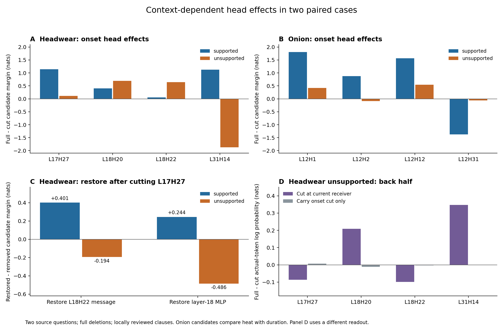

# 重采样配对结果：head 的条件作用、下游响应与持续性

2026-09-20。实读本轮上传的 `paired_review.tar.gz`，按 CSV 重新验算。这里是两个来源的局部机制审计，不是检测器成绩。本轮只做 CPU 复核、导出和绘图，没有重新运行 LLM。

**最清楚的结果：head 的有限作用随语境、来源位置、另一个 head 是否存在而变化；头饰案例还出现正负侧不同的下游响应。冲突、条件反转都出现在有依据侧，尚不能作为幻觉专属标志。固定文本下，起点单次干预传到后半段的作用很弱。**



## 1. 实际测到了什么

| 项目 | 复核结果 | 解释边界 |
|---|---:|---|
| 独立来源 / 局部声明配对 | 2 / 2 | 不能把重复 head、剂量和阶段当独立样本 |
| 阶段 | 16 | 两例 × 两侧 × before/onset/back-half/post |
| 单独干预 | 1120 行 | 含来源组、剂量和等范数随机扰动 |
| 联合干预 | 448 行 | 不等于 448 个协同发现 |
| 下游恢复 | 32 行 | **全部来自头饰案例** |
| 起点干预的后续作用 | 40 行 | 两例各 20，含随机选头控制 |
| 已保存控制的失败 / 缺测 | 各表均 0 / 0 | 当前包已修复 -64/-80 的布尔计数错误 |
| 效应公式的最大绝对残差 | < 2×10⁻¹⁵ | CSV 内部算术一致，不是模型估计误差 |

所有已保存 sham/null 误差为 0；但 `interactions.numeric_ok` 取两个**单独 sham** 的最大误差，没有另跑联合 sham。不能把 448 行描述成 448 次独立联合数值控制。

每例的四个候选 head 由两侧 onset 梯度共同选择，另有一个随机选头控制；正负侧各只有一条回答。当前有限干预是在同例上探索这些候选的作用，尚未在独立来源上确认选头或方向。

生成器缓存与原生回放的最大 top-logit 差分别为 0.125、0.125、0.25、0.125；消息相对误差约 0.00070–0.00123，处于配置容差内。它们衡量回放一致性，不是干预效应的标准误。bf16 下的零 sham 也不替代剂量或高精度复验。

四条原 trace 都没有 `logit_entropy`，因此缓存熵、熵 EWMA、RAUQ 对照缺失；原生干预仍有结果。这里的缺熵不等于此前 CHARM 的“过去检测分数 EWMA”实验不可用。

## 2. 先固定读出含义

在 onset，设

\[
F=\log P(c_{supported}\mid x)-\log P(c_{unsupported}\mid x),\quad
D_A=F-F_{-A}.
\]

`D>0` 表示原消息维护第一个候选的**相对分数**；不保证提高它的绝对概率，也不等于证明消息包含真实事实。`D<0` 是相反的相对作用。完整候选评分包括强制候选续写。

其他阶段的 F 是**实际下一 token 的 log 概率**。正值只表示维护当前实际 token，不表示维护真相。两种读出不拼成一条“真假随时间变化”曲线。

条件作用和非加性分别是：

\[
D_{A\mid-B}=F_{-B}-F_{-A,-B},\quad
J=F-F_{-A}-F_{-B}+F_{-A,-B}=D_A-D_{A\mid-B}.
\]

J 的符号本身不命名协同或抑制；下面直接展示四世界与条件作用。描述性门槛 `|effect|>0.05 nats` 不是显著性检验。

## 3. 头饰：证据通路仍在，自位置通路的方向变了

支持候选是普通人的布帽；无依据候选把统治者专属的金饰羽毛头饰推广给普通人。两侧完整 F 为 **+7.643988 / -4.697483**。表中为 onset、全剂量、整 head 在当前 receiver 的删除作用：

| head | 有依据侧 D | 无依据侧 D | 当前能说什么 |
|---|---:|---:|---|
| L17H27 | +1.140928 | +0.114427 | 两侧均维护第一个候选，强度不同 |
| L18H20 | +0.406177 | +0.696375 | 无依据侧仍保留强正作用 |
| L18H22 | +0.055149 | +0.643604 | 作用依赖剂量与其他 head |
| L31H14 | **+1.128012** | **-1.868490** | 同一物理 head 在两侧反向 |

进一步分来源：

| 干预范围 | 有依据侧 D | 无依据侧 D |
|---|---:|---:|
| L31H14：全部回答 history | +1.129491 | -1.851404 |
| L31H14：query_self | **+1.136390** | **-1.840302** |
| L31H14：prior_history，排除 self | +0.005909 | -0.005360 |
| L18H20：evidence | **+0.445407** | **+0.835930** |
| L18H20：inapplicable_source | -0.296596 | -0.236364 |
| L18H22：evidence | -0.402723 | -0.530732 |
| L18H22：inapplicable_source | +0.239873 | +0.243613 |

因此，先前“history 很强”的说法需要细化：L31H14 的直接来源主要是当前 query 所在位置，远处已生成 token 的直接读取很弱。但 **self 向量已经编码过去上下文**，不能进一步推成“没有历史信息”或“它只表示当前注入”。不同来源组有包含关系，有限删除效应也非线性，不能相加当作贡献分解。

另一个重要结果是：无依据生成不等于证据通路消失。L18H20 的 evidence 作用反而更强；L18H22 对同一 evidence 区间却是反向。语义上标为“不适用来源”的片段，也可能在某 head 中维护有依据候选。来源标签只说明文本适用关系，不能自动决定消息的功能或符号。

删除无依据侧的 L31H14 后，F 从 -4.697483 改善到 **-2.828993**，仍偏好第二候选。已测整头单删和两头联合删除都未将其改为正值。因此它是一个重要参与者，尚不是单独足以解释或修复错误的开关。

自然前缀仍有混杂：有依据侧接在 “added cloaks and” 后，无依据侧接在 “and wore” 后；两候选 10 vs 11 token，含单复数和措辞差异。有依据回答前文还包含另一处概括错误。因此这里不是“全程正确历史 vs 全程错误历史”的实验。

## 4. 联合效应：正常生成也有条件反转

头饰的 A=L18H22、B=L18H20：

| onset，dose=1 | 有依据侧 | 无依据侧 |
|---|---:|---:|
| F 完整 | +7.643988 | -4.697483 |
| F 删除 A | +7.588839 | -5.341088 |
| F 删除 B | +7.237811 | -5.393859 |
| F 同删 A、B | **+8.034720** | -4.991574 |
| D_A | +0.055149 | +0.643604 |
| D_A，在 B 缺席时 | **-0.796909** | **-0.402284** |
| D_B | +0.406177 | +0.696375 |
| D_B，在 A 缺席时 | **-0.445881** | **-0.349514** |
| J | +0.852058 | +1.045889 |

有依据侧中，分别删 A 或 B 都降低 F，同时删两者反而提高 F；两侧都出现条件作用反向。这是有实质大小的非加性现象，但不能叫幻觉专属冲突，也不代表同层 A 向 B 直接传递信息：同层消息在后续计算中共同作用即可产生这种现象。

剂量限制不能省略：无依据侧 dose=.25 时，两个条件作用是 **+0.013628、+0.021802**，没有上述反向。有依据侧 L18H22 整头 D 还从 dose=.25 的 **-0.096910** 变成 dose=1 的 **+0.055149**。不能把完全删除的方向当作稳定的小扰动功能。

## 5. 洋葱：有依据侧也有强烈相反作用，且候选读出需重设计

| head | 有依据侧 D | 无依据侧 D | 主要直接来源线索 |
|---|---:|---:|---|
| L12H1 | +1.803716 | +0.423701 | 有依据侧 prior_history +1.127712 |
| L12H2 | +0.879283 | -0.088663 | 有依据侧 prior_history +1.229666，self -0.351625 |
| L12H12 | +1.562285 | +0.546234 | 两侧 self +1.504506 / +0.560950 |
| L12H31 | **-1.370950** | -0.062671 | 有依据侧 prior_history -1.110003 |

有依据侧 L12H1 与 L12H31 的单独作用很强、方向相反，联合删除作用仅 **+0.093245**。正常的局部生成本身就有大幅抵消。无依据侧多数 head 的作用变小；它并不表现为所有相反作用都更强。

无依据侧 L12H2 与 L12H31 的单独 D 为 -0.088663、-0.062671，另一个 head 缺席后则变为 +0.142380、+0.168371。仍是条件依赖，尚无独立来源复验。

**更根本的限制：两个候选是 “over low heat”（3 token）与 “for 10 to 12 minutes”（7 token）。** 它们回答火力与时长两个不同属性，可以同时出现在一句话里，不能直接构成互斥事实选择。完整 F 在有依据侧为 +6.077786，在已经生成错误时长的无依据侧仍是 **+0.074581**。完整短语长度、语法和属性选择都会影响它。

此外，无依据前缀已经写了 “Remove the bratwurst from the grill”，有依据前缀则是锅内移除；原材料中 10–12 分钟对应的是从啤酒混合物取出之前的阶段。被测 onset 未必是首次阶段错配。下一轮应固定时长载荷，检验它绑定到移除前还是移除后，并把干预前移到阶段关系尚未确定的位置。

## 6. 下游恢复：当前最值得复验的语境差异

头饰删除 L17H27 后，恢复同一 receiver 的 L18H22 原消息，或第 18 层原 MLP 输出：

| 量 | 有依据侧 | 无依据侧 |
|---|---:|---:|
| 原始 F | +7.643988 | -4.697483 |
| 删除 L17H27 后 F | +6.503060 | -4.811910 |
| 恢复 L18H22 消息的 gain | **+0.400866** | **-0.194018** |
| 恢复第 18 层 MLP 的 gain | **+0.243851** | **-0.485523** |

有依据侧恢复后靠近原始分数；无依据侧恢复后更远离，且使有依据候选的相对分数更低。对该受控删除而言，无依据侧让下游自然响应，比把它冻结回原始输出更有利，符合**该干预下存在部分补偿**的解释。它不表示原本错误生成正在主动纠错，也不证明唯一自然中介路径。

另一条 L18H22→L31H14 路径，在有依据侧删除作用只有 +0.055149，恢复 MLP 的 gain 却达 +0.478247，超过原始 F。这个 overshoot 明确说明不能把 gain/deletion 当作普通的“中介占比”。

**洋葱没有下游恢复结果。** 选出的四个候选头全部在第 12 层，当前程序只安排先后层关系，合格跨层 pair 为 0。32 行恢复全部属于头饰。需要固定地加入后续层的候选节点后再测，不能把空表解释成洋葱没有补偿。

## 7. 持续性：本实验没有证实“起点错误持续传到后半段”

固定原生成文本，只在 onset receiver 删一次 head，随后读取 back-half/post 的实际下一 token 概率：

- `|D|>.05` 只有 **1/40**；back-half 为 **0/20**。这些包含随机选头控制，不是 40 个独立试验单位。
- 唯一越过 .05 的是洋葱无依据侧 L12H12 在 post 的 **-0.178478**：删除起点消息反而提高后续实际 token 概率，不是持续维护错误的直接证据。
- 洋葱有依据侧 L12H2 在 post 为 **-0.049702**，接近门槛。阈值改为 .025 时是 5/40，不能把未过 .05 说成绝对没有效应。

头饰无依据侧 back-half 可以直接比较同一读出下的两个干预时间：

| head | 此时重新删除 D | 只删除 onset 后传到此处的 D |
|---|---:|---:|
| L17H27 | -0.086180 | +0.007513 |
| L18H20 | +0.208330 | -0.012112 |
| L18H22 | -0.099139 | -0.002793 |
| L31H14 | +0.346608 | 0.000000 |

当前位置的作用仍可较大，起点那一次删除的后效却很弱。最后一层 L31 的过去 receiver 在标准因果 Transformer 中已没有后续层把改变送给未来位置，故其固定文本跨位置零效应有结构性原因，不应当作“记忆自行消失”的发现。

这个实验固定了中间 token，阻断了“改变起点输出→后续文本改变→继续强化”的途径；单头删除也可能被其他通路补偿，且 onset 可能晚于语义承诺。因此阴性结果只约束当前干预协议。两侧有依据 back-half 的原下一 token 概率还分别约 .99952、.99919，单一 token 读出接近饱和，需另有持续的事实关系读出。

这与此前监督分数的连续性可以并存：检测分数在相邻 token 上相似，可能来自持续重复的当前状态、共享上下文和长标签，而不需要“同一个 onset head 写入一直因果支配后文”。当前数据没有给出监督训练贡献的百分比。

## 8. 随机控制与功能命名的边界

等范数控制是**减去随机方向向量**，不是替换成随机 donor 消息。若干随机方向也产生大效应：头饰无依据侧 L31H14 为 +1.334835，洋葱有依据侧 L12H12 为 -1.292876。每项仅一个随机 seed，不能从中估计零分布或证明语义特异性。

当前删除的是 AV 经 W_O 后在指定 receiver 的整头或来源子消息。它说明这一写入怎样影响候选分数；尚未分离 query 如何提出问题、key 如何标记地址、value 如何承载内容。**现在不能把这些头直接命名为指针头、地址头或载荷头。**

## 9. 下一轮收敛为三个实验问题

| 优先级与问题 | 操作和必要对照 | 可接受的证据 / 退出条件 |
|---|---|---|
| 1. 是否真是对象/阶段绑定，而非措辞选择？ | 头饰固定句式、单复数和槽位，只换普通人/统治者适用关系；洋葱固定 10–12 分钟载荷，比较它属于移除前/后。分别做源关系改写与自然前缀受控改写，人工核验反事实；保持词项尽量一致。 | head/条件作用应随正确适用关系改变，且在同义改写下保持。若主要跟随单复数、候选长度或属性切换，停止“事实绑定功能”的命名。 |
| 2. 下游响应差异是否可复验？ | 预先固定头饰 L17H27→L18H22 及 L18H22/L18H20 pair；记录 .25/.5/1 剂量。洋葱按固定后续层规则补节点；增加明确联合 sham、多随机方向。匹配前缀后再作分离的 Q/K/V 交换，核对有效位置。 | 分开报告 head 删除、条件反转、冻结下游后的变化；语义 donor 应比同义/无关 donor 更有针对性。若只在完全删除或语法不匹配时成立，不推广为自然功能。 |
| 3. 连续状态到底通过什么维持？ | 从阶段承诺前、onset、后续位置分别做一次性删除；保持同一事实关系读出。分开固定文本、放开短续写，以及逐位置反复删除；正常确定续写采用相同安排。 | 固定文本测内部传播，放开文本测经生成内容传播，逐位置删除测当前持续重建。报告首次语义错误与恢复，不用标注终点自动定义恢复。 |

第一步可先完成原有缓存诊断导出，避免无谓重跑；对确需新前缀/新干预的条件另设实验输出，不覆盖旧缓存。以上新 LLM 实验本轮**尚未执行**。

图结构可以保存这些结果，但当前适合的是**带类型、head 身份、位置和上下文的干预记录**：单写入作用、两个写入的四世界、跨层恢复试验、跨位置传播试验分表。非加性可以作为 pair 关系记录，不能当作同层有向信息流；不要用一个 GNN 分数提前掩盖读出和适用性问题。

每 token 的“历史 / 当前注入”双状态目前也没有必要先定成模型内部事实。至少保留 `prior_history`、`query_self`、prompt 证据位置，并承认 self 中已包含历史；否则恰好会把这次最明显的区别重新混在一起。

## 10. 已完成的代码与复核

- `paired_exports.py`：仅从已有 NPZ 的 JSON record 导出候选逐 token、总和、均值、首词和尾部读出；不加载激活、不调用模型。新增逐阶段读出可用性和跨层恢复覆盖表。
- `paired_report.py`：report 阶段自动执行这些导出，生成的 `paired_review.tar.gz` 包含 JSON 明细；说明联合控制的真实含义。测量公式和原生干预协议未改。
- `paired_review.py`：从本次实际 CSV 生成逐头、四世界、恢复、持续性对照表及图片；保留 readout，检查算术一致性。

当前上传包没有 baseline/world NPZ，也没有其已导出的 JSON。因此**无法从本包恢复完整候选的逐 token 概率、均值分数或候选首词概率质量**；新代码会明确标为缺失，不补零。只需在保有原 NPZ 的机器上重跑 report：

```bash
python -m experiments.path_conflict.paired --stage report --output <原审计输出目录>
```

本报告的表和图可由解压后的本次包直接复现：

```bash
python -m experiments.path_conflict.paired_review \
  --input <解压后的paired_review目录> \
  --output results/paired_native_20260920
```

CPU 测试 `test_paired_report.py`、`test_paired_exports.py`、`test_paired_screen.py` 共 **7 passed**，覆盖布尔计数、缺测、同层无恢复配对、JSON 概率保真及打包排除激活；在本包副本上实际跑通 report 入口，正确报告 16 个 baseline record 缺失。原生 transport 测试依赖 torch，当前环境未安装，收集阶段失败；未把软件测试称作新自然机制实验。

与连续性和句子检测的更大样本证据对照，见 [此前的连续性复核](CONTINUITY_EVIDENCE_20260920.md)。该报告当时尚未获得本次完整包；本报告补上实际 head 干预结果。
