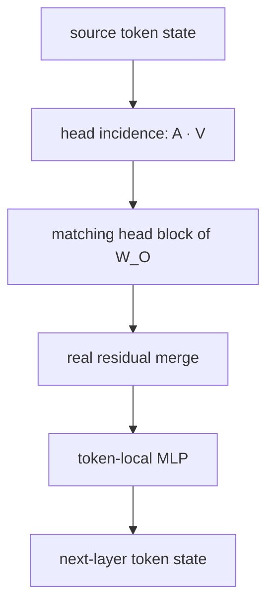

# Evidence-Adoption Incidence Graph

This experiment asks one narrow question: when a response token becomes
unsupported, how much do its direct evidence-token attention-value writes
matter, and how much support remains from strict history after those writes are
cut at response predictor queries?

The earlier prompt-carrier-collapse score is not the formal method. Its QA
result was useful, but Summary and Data2txt showed why an all-prompt
concentration statistic is not a task-general detector: looking at a source is
not the same as using it, and correct tokens can legitimately retrieve a very
small source span.

## Incidence graph

For target response token `t`, the causal predictor is
`q_t = response_start - 1 + t`. At layer `l`, query head `h`, and source token
`s`, the graph records the dynamic source-head incidence magnitude

    e[l,h,t,s] = A[l,h,q_t,s] ||W_O[l,h] V[l,g(h),s]||_2

`g(h)` is the GQA query-to-KV mapping. The graph keeps source, layer, head, and
target identity. Sources are partitioned into direct evidence, other prompt,
strict response history, and predictor self.

This scalar measures incidence magnitude, not whether a source supports or
opposes the chosen token. Direction and cancellation are retained separately:
the model sums `A V` inside each head and source role, applies that head's
matching `W_O` block, and merges the resulting vectors in the shared residual
stream. Heads are never averaged to construct the graph. The MLP is a local
transition after the real merge, not a fabricated source-to-token edge.

For compact storage, each `(layer, target, head)` computes separate evidence
and strict-history covers. Each is the smallest source set carrying 80% of that
role's incidence magnitude. The artifact stores the required cover size, the
leading sources that fit the compact slot budget, and all remaining mass.
Other prompt and predictor self remain in dense role summaries but do not
receive sparse covers. Those summaries preserve mass, entropy, top source,
route rank, and joint effective routes without pretending omitted sources are
zero.

The serialized `RouteGraph` is a layer-local head-source incidence graph, not
a complete cross-layer ancestry graph. It does not connect equal-numbered heads
between layers and cannot by itself decide whether a response-history source is
evidence-grounded. The MLP and four-branch pathway traces are separate
finite-difference audits, not invented ancestry edges.

## Primary endpoint

The same frozen model runs four aligned branches:

| Branch | Removed at response predictor queries |
|---|---|
| `full` | nothing |
| `no_evidence` | direct-evidence attention writes |
| `no_history` | strict response-history attention writes |
| `no_evidence_history` | both sets of writes |

The deletion is applied at every aligned response predictor query during
replay, so its consequences continue through later layers and response KV
states. Predictor self remains present in every branch. With target-token log
probabilities from those branches, the fixed raw endpoint is

    unsupported_history_takeover
      = (no_evidence - no_evidence_history) - (full - no_evidence)

The first difference measures how much strict history can still support the
target after direct evidence-token attention-value writes are cut at response
predictor queries. The second measures the contribution of those direct writes
in the full computation. This cut does not remove all evidence: other prompt,
predictor residual/self, MLP, and evidence already propagated into prompt or
response states remain. A high raw value therefore indicates relative history
takeover under this specified intervention. It is computed by real model
intervention; no graph encoder or hand-weighted feature sum defines the
endpoint.

The reported primary score with the same name is not this raw log-probability
difference. For each source-disjoint fold, fit sources regress the raw endpoint
on relative response position, squared position, and separate prompt,
evidence, and response lengths. Different calibration sources define its
empirical CDF. Held-out tokens receive the resulting out-of-fold percentile.
Confidence (`-full_logprob`) remains a separate control; neither confidence nor
target margin enters the nuisance regression. The raw endpoint is reported
separately as a post-hoc audit.

Every nuisance fit must have at least six rows and full rank for the six fixed
columns. A run that cannot satisfy that contract reports the mechanism scores
as unavailable instead of silently using an underdetermined pseudoinverse.
Route-contraction controls use only tokens with a real prior route for
comparison; a held-out token without such a baseline receives the fixed neutral
percentile `0.5` and never enters fitting or calibration.

The first two response targets have no strict-history source distinct from
predictor self. They are marked `detection_valid=False` and excluded from
detector fitting, calibration, and evaluation. Reports therefore show both
total `tokens` and the smaller `evaluated_tokens`.

## What the graph explains

The graph tests why the endpoint is high without replacing it:

- per-head evidence and history incidence magnitude, role write norms, and
  cross-head cancellation at the real residual merge;
- role-specific adaptive-cover size, source anchors, joint effective routes,
  and cross-head route rank near hallucination onset;
- effective route-support contraction and total route-mass contraction as two
  separate audits, never a weighted mixture;
- the full 2x2 evidence/history/interaction contrasts in attention output, MLP
  output, and residual state;
- whether the MLP amplifies, cancels, or rotates evidence-conditioned state.

Route contraction is an onset-local control, not a universal claim that an
entire hallucinated span must stay on a few prompt tokens. Likewise, an MLP
projection can show adoption or cancellation of an intervention difference;
it cannot by itself identify parametric knowledge.

The historical "attention bias" hypothesis would require controlled pairs
with matched prompts and an independently known model prior, ideally including
a counterfactual fact. RAGTruth provides evidence-supported versus unsupported
response labels, so this experiment can test evidence bypass and history
takeover, but not pure parametric bias.

## Files and outputs

- `capture.py`: dynamic incidences, four causal branches, and pathway traces.
- `collect.py`: dataset traversal, boundary checks, serialization, and resume.
- `graph.py`: adaptive covers and the incidence graph.
- `detect.py`: the primary endpoint and prespecified controls, with labels
  sealed.
- `evaluate.py`: label-opened metrics, source-cluster confidence intervals, and
  post-hoc mechanism audits.
- `run.py`: the single foreground command.

Schema 7 requires a fresh capture; older route-collapse artifacts are not
reused. Run all tasks in the foreground:

    bash experiments/attention_mechanism_audit/run_all.sh

The shell file contains only:

    python -m experiments.attention_mechanism_audit.run all

Outputs are written under
`experiments/attention_mechanism_audit/outputs/<observer-model>/`. Capture
artifacts live in `mechanism_state/train/` and `mechanism_state/test/`, while
`qa/`, `summary/`, and `data2txt/` each receive their own `report.json`,
`token_scores.npz`, and population figures.

Detection reports use token-micro AUROC and sklearn average precision (`AP`),
with source-cluster bootstrap intervals. They separately report total and
evaluated samples, sources, and tokens, plus the comparable coverage of each
route control.

Run the focused test suite with:

    python -m pytest -q experiments/attention_mechanism_audit/tests
