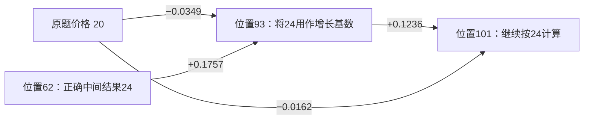

# 约束传播与采纳：三轮读出、密集复验及实际消息路径

## 本轮完成了什么

12答：RAGTruth来源的2组同prompt自然正负局部配对（4答），官方养老金15604/WiFi9022两个旧难例，ProcessBench GSM8K三组同题正负（6答）。新测首轮832query，全32层×32物理头×3固定竞争词；之后GSM六答全部2310token密集补测（包含原先352个位置）。最终唯一已测位置2790，不把重复采集当成新独立样本。

原生value/attention/局部和下游梯度完整因子保存在约20GB原件中。460次无标签选点幅度干预＋250次配对位置幅度诊断＋250次零和地址交换＋100次同值固定头诊断，共1060个干预测量点（包含212个零剂量，不是1060个独立样本）；其中600次保存完整32×4096 hidden变化。

主方法仍没有通过统一检测目标。取得的是更准确的消息作用测量、一个明确的attention sink混杂，以及同一数值在不同计算角色下的读取/复用差异。没有更换原强路由默认，没有跑完整三任务测试。

## 核心模型

消息m=A W_O V，按层、物理头、接收query、来源key、输出候选五个轴保存。native效应g_c^T m，g_c为原词相对固定竞争词的原生下游梯度；local效应在本层attention写入后作即时logit-lens读出。前者包含当前query后续attention/MLP，历史K/V固定；不能当跨时间完整因果链。真实有限干预另保存同一扰动的32层hidden路径。

原值包含约束、主题、语言、模板等混合载荷，原始prompt不事先标注实体/正确证据。模型读到某key、效应非零、信息支持某候选，均不直接证明关系适用。

v1按归一化冲突比例取top8头。发现这些高比例头仅占约.5–.9%作用量，却令几乎所有位置得分.95，正常与错误一起报警。v2改为全部1024头按作用量加权，三个候选按最终条件概率加权，保留净作用/反转等对照。GSM均匀8点/step的.6667在全位置复验降到.4921，不能用稀疏结果宣称提升。

10个配对位置诊断中，7个由L31H5和开头BOS/系统模板主导，说明直接消息幅度扰动混入通用载荷。v3将每头当前已测query平均prompt attention最大的地址b作为常驻参考；它通常是sink，但不假定每个头都如此。以零和地址交换替代幅度扰动：

    delta A_j = epsilon A_b A_j
    delta A_b = -epsilon A_b A_j
    T_j(c) = A_b A_j g_c^T W_O (V_j - V_b)

联合处理相加。±.25时分布保持非负，总质量不变；共同value偏移被消去。它衡量具体内容相对常驻载荷的作用，无需人工标记BOS之外的证据。真实小剂量重放验证斜率。没有根据测试翻转方向或调参数。

## 检测结果：主候选全部公开

RAG局部31token（18错、13正常）、其他48邻域unknown；官方两答401token/34错误。GSM44step中24已知（3首错、21正常），首错后20未知。旧难例15604属于fit、9022属于dev；全部样本历史暴露。自然局部标注不认证整份回答正确。正负配对prompt token完全相同；GSM对照生成器不同，不能排除其风格差异。

|轮次/固定主候选|头饰+洋葱局部AUROC|养老金15604|WiFi所在9022|GSM步骤AUROC|
|---|---:|---:|---:|---:|
|v1 / binding_conflict|0.3291|0.7493|0.3704|0.4921|
|v2_sparse / energy_conflict|0.6068|0.5854|0.2723|0.6667|
|v2_dense / energy_conflict|0.6068|0.5854|0.2723|0.4921|
|v3 / energy_conflict|0.6880|0.5479|0.3849|0.4762|

旧完整参考路由在养老金/9022分别.7229/.8668，旧融合.7000/.8924。新主候选尚未超过这些有效基线。两个官方回答属于不同任务，混合AUROC也保存，但不代替逐案例表。

v3来源反对分量energy_opposition在GSM达到.841270，固定>.5精确定位三个首错；**三个全正确回答也全部误报**，21正常step中9FP。它只是预先保留的分量对照，不据此改主方法，更不能称可用。主energy_conflict固定.5无报警，零误报伴随全漏；不通过调阈值掩盖排序失败。所有工作点均为探索性的固定比例阈值，没有独立dev FPR校准。

v3所有候选如下；GSM为密集测量：

|分数|局部配对AUROC|官方两答混合AUROC|GSM AUROC|
|---|---:|---:|---:|
|energy_conflict|0.6880|0.4140|0.4762|
|energy_opposition|0.4060|0.4771|0.8413|
|energy_reversal|0.7137|0.5437|0.4603|
|energy_cancellation|0.7393|0.2839|0.1905|
|net_conflict|0.5256|0.3736|0.5238|
|energy_conflict_max|0.6154|0.4155|0.4921|
|negative_margin|0.3974|0.5389|0.4444|
|nll|0.3932|0.5373|0.5238|
|prompt_deficit|0.3803|0.5116|0.5079|

## 具体发现：不是没读到20，而是24被放进了错误的计算角色

GSM8K-49要求每两月增加“原价20美元的20%”。步骤1正确计算20+4=24；步骤2错误地将24用于下一次20%增长的基数。当前观察器在错误位置仍有很大的24-vs-20 margin，不确定性不能定位。

第三轮在位置93自动选中L30H29、24-vs-20对比。原题数值20（prompt key11）attention=.017308，零和交换斜率−.034913，方向反对24。历史位置62的正确中间结果24则提供+.175653的促进。在后续位置101，历史位置93的24提供+.123616，原题20仅−.016161。以下箭头是各接收位置在固定原历史下的独立消息效应，不能相乘声称已经验证跨时间总因果链。

有限干预核验这些实际来源/历史消息，同时比较最强非复现历史消息及联合效应；没有把正确配对答案作为检测输入。此前“从已知错误起点传播”的方法会漏掉这种情况：第一次误用来自一个本来正确的中间值，之后才出现对错误基数位置的持续读取。

同一个token、同一个头、同一个候选对的对照更能揭示问题：

|回答位置|步骤及文本角色|24-vs-20 margin|原题20的交换斜率|全头来源反对分量|
|---:|---|---:|---:|---:|
|62|正常步骤1：20+4=24的结果|10.4592|-0.118834|0.496656|
|93|首错步骤2：20% of 24的基数|10.6083|-0.034913|0.505919|
|101|首错步骤2：0.20×24的基数|10.9742|-0.016161|0.504552|
|112|首错步骤2：24+4.80中的前次价格|12.8614|-0.021492|0.505109|

正常结果24也受到原题20的反对，而且在这个头里反对更强。因此“prompt反对当前词”并不等于错误：正常计算本来就会产生题目中没有直接给出的数值。反过来，位置112的24可以正确表示前次价格，出错的是增长量4.80；不能因为它同处首错步骤或复用相同状态，就给这个24编造token错误标签。

这把后续研究切入点缩小到**同一值的角色条件下的绑定与复用**：从哪个来源/历史位置读取，当前将其当操作数、结果还是引用，哪些候选在竞争，这些关系必须同时保留。二元“正确/错误状态”、统一JS稳定性或一个冲突总分不足以表达它。本轮建立并核验了作用张量和消息路径，尚未实现可靠的无监督计算角色识别。

## 干预与整合的证据边界

来源块独立/联合非加性Gamma=Deltaf(A+B)−Deltaf(A)−Deltaf(B)，另测A+matched-control。旧幅度诊断在+.25下，归一化|Gamma|中位约.000209，而控制约.001346；不能把任意非加性包装成约束整合专属信号。第三轮零和试验同样保存全部控制，不以某一个大的交互举例宣称机制成立。

layer-state路径保存完整hidden变化和当前候选投影。变号既出现在正确对照，也出现在错误案例，路径曲折不自动判错。AtP类工具有效回答“这个改变影响输出多少”，还需单独证明其事实检测有效性。上述GSM同值对照正是必须保留的反例。

## 实施、核验与数据

7项针对性测试通过：局部lens梯度、原生message/零和gate梯度、self键归属、两来源块缺第三对照、弱头不能主导、因子计算等价、共同value偏移不变。126个cohort-method AUROC以另一秩公式复算，TP/FP复算；新旧RAG复用78数组逐值相同。模型重放最大margin偏差8.59e-5，低于冻结.005容差。

初始finite在只有两个自动来源块的GSM题上没有第三控制块而中止；保留已完成280行和失败日志，修复后从完成回答恢复，未补造对照。微小1e-3剂量toy检查遇FP32 RMSNorm差分舍入，改用独立gate梯度身份验证，真实8B仍保留±.05/±.25有限重放。结果原件和失败日志均保存。

所有原始输出在graph/outputs/constraint_uptake_20260929_{v1,v2,dense,v3,exchange,same_value}。scores不含标签拟合；样本和后续诊断位置使用既有标签，属于机制发现，不能称独立无监督验证。四个自然RAG回答只测局部窗口，其常驻地址参考也来自已测窗口；完整回答部署尚未验证。

代码与运行说明见README.md。旧路由默认不变，没有活动实验。共享目录保存预先方案、文献表、原始指标摘要、同值及历史地址清单，方便继续研究。
