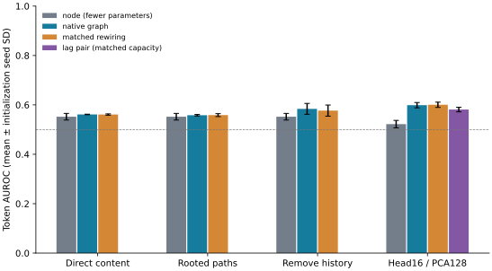
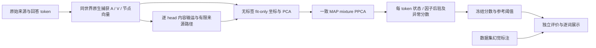

# Flow latent：无监督 token 图条件因子模型

独立项目子文件夹。先设计、再规划、再原生捕获与 EM 拟合，最后用已有样例逐词评价。模型不是真假分类器：每 token 输出条件密度异常和独立潜在状态后验；真假标签仅供评分冻结后的评价。完整 MMSB/attention 行 Dirichlet 生成模型尚未实现，本项目先检验图条件 mixture PPCA 子模型。

- 方法：[METHOD_DESIGN.md](METHOD_DESIGN.md)
- 计划：[EXPERIMENT_PLAN.md](EXPERIMENT_PLAN.md)
- 共享追踪：`/share/home/tm902089733300000/a903202310/lys/codex/research/refine-logs/flow_latent_project_20261007/`
- 原始捕获：`graph/outputs/flow_latent_20261007_capture/`
- 迭代输出：`graph/outputs/flow_latent_20261007_map_v{1,2,3}/`；每版含模型、拟合轨迹、冻结分数、阈值、指标及逐词 `tokens.html`。

三个预定版本分别使用直接来源/历史内容、多跳来源内容、删除历史条件。每版均保留无边和词项/类别/距离匹配乱边，真实图和乱图分别拟合，避免把异分布输入送入单个已训练模型作为唯一对照。Dirichlet 用于全局混合权重先验；每 token 后验是 categorical。attention 是条件图，未拟合其生成似然。原生多层同世界图来自 Llama3.1 observer，不能解释原 Llama2 生成器的内部机制。

保存全部32层×32头×128坐标和完整 attention（磁盘 float16），建模特征在 FP32 attention×V 上计算；先固定128→4坐标投影，再仅用 fit 来源学习 PCA。因此保存全维不代表密度模型保留全维信息。严格 DAG 的来源路径使用 γ=.5，有原始幅度，无全 head 均值和分组共分；不是完整 FlowTracer sink 条件流。

## 运行

从 graph 根目录执行，复用现有 research Python 环境，无新增依赖：

```bash
export PYTHONPATH=.:teaching/state_audit/src
export OMP_NUM_THREADS=4 OPENBLAS_NUM_THREADS=4 MKL_NUM_THREADS=4
PYTHON=/share/home/tm902089733300000/a903202310/lys/conda_envs/research/bin/python
$PYTHON -m unittest experiments.flow_latent.test_science -v
$PYTHON -m experiments.flow_latent.capture --output outputs/flow_latent_20261007_capture
$PYTHON -m experiments.flow_latent.run --capture outputs/flow_latent_20261007_capture --output outputs/flow_latent_20261007_map_v1 --version 1 --seed 42
$PYTHON -m experiments.flow_latent.evaluate --output outputs/flow_latent_20261007_map_v1
```

v2/v3 分别改 version 和 output；seed43/44 必须使用新的输出目录。输入53答=24 fit+12 reference+17 regression，来源互斥；regression 已反复研究，属于探索性回归。reference可能含错误，95百分位仅是参考报警预算。评分文件不可覆写，评价会验证冻结哈希。

完整预定迭代：`python -m experiments.flow_latent.cycle --capture outputs/flow_latent_20261007_capture --prefix outputs/flow_latent_20261007_map --seeds 42 43 44`。运行后 `summarize --prefix outputs/flow_latent_20261007_map` 汇总全部seed。初轮不一致ridge更新保留独立输出；默认代码已修正为一致MAP，见 [MAP_CORRECTION.md](MAP_CORRECTION.md)。

实际结果见 [RESULTS.md](RESULTS.md) 和 [RESULTS.json](RESULTS.json)。三版一致MAP加较高保真检查的3seed对比如下，误差条仅为初始化seed标准差：



完整原始证据见 [ARTIFACT_INDEX.md](ARTIFACT_INDEX.md)。

## 数据到逐 token 后验



## 较高保真度追加版

原随机4坐标仅保留原节点协方差约3.09%；对24个fit来源学习每head top16后保留约59.76%。继续用全部物理头、fit-only PCA128、factor rank8拟合第三版及匹配乱边控制（node-only参数量较少），见 [FIDELITY_CHECK.md](FIDELITY_CHECK.md)。属于追加探索检查，同时改变坐标保真度与因子容量。

```bash
$PYTHON -m experiments.flow_latent.reproject --capture outputs/flow_latent_20261007_capture --output outputs/flow_latent_20261007_head16
$PYTHON -m experiments.flow_latent.run --capture outputs/flow_latent_20261007_head16 --output outputs/flow_latent_20261007_head16_v3 --version 3 --seed 42 --node-dimensions 128 --context-dimensions 128 --factor-rank 8
$PYTHON -m experiments.flow_latent.evaluate --output outputs/flow_latent_20261007_head16_v3
```

## 容量审计补充

[CAPACITY_CONTROL.md](CAPACITY_CONTROL.md)固定同输入宽度、PCA128/K4/rank8的前两个节点对照，保持已有图模型及全部分数不变。最终子空间保留训练原节点方差45.18%，参考29.61%，回归31.01%；消息保留率未测。30步EM为固定计算预算，未宣称所有初始化收敛。

```bash
$PYTHON -m experiments.flow_latent.freeze_cache --caches outputs/flow_latent_20261007_capture outputs/flow_latent_20261007_head16
$PYTHON -m experiments.flow_latent.control --capture outputs/flow_latent_20261007_head16 --base outputs/flow_latent_20261007_head16_v3 --output outputs/flow_latent_20261007_head16_control_bound_seed42 --seed 42
$PYTHON -m experiments.flow_latent.evaluate --output outputs/flow_latent_20261007_head16_control_bound_seed42
```

已存在的manifest使用 `--verify`；已有模型与评分输出不覆写，重运行需使用新目录。完整缓存哈希在原21次拟合之后建立，只保护建立后的重现与后续对照。

审计已完成，见 [EXPERIMENT_AUDIT_FRESH.md](EXPERIMENT_AUDIT_FRESH.md)：WARN，同家族provisional。lag_pair与图条件的“同容量”仅表示参数形状匹配，不保证信息含量或有效复杂度相同。
