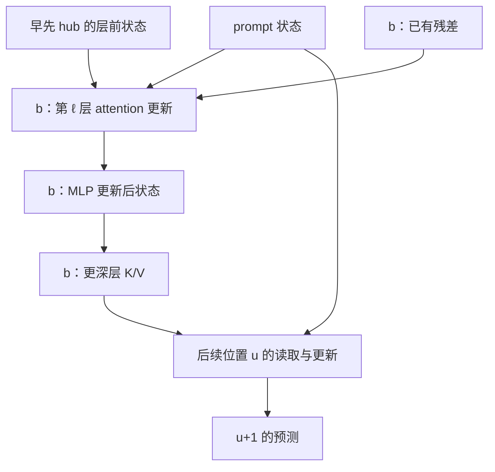

# ICLR 研究主线：约束信息在 hub 中的形成、传递与使用

更新：2026-09-07。本文汇总项目讨论、可核验结果与文献依据，并给出下一阶段的具体算法和实施顺序。
本文件是 `reanchor_flow` 的统一研究设计；`METHOD.md` 仅用于旧版复现。

**当前决定：以“原生计算图上的约束响应传播”作为唯一机制审计主线。先观察自然生成的读取与复用，再用有效的语义配对输入，精确分解路由变化、内容变化、MLP 更新及最终读出；检验同一个 hub 是否实际连接这些过程。**

这里有明确的可实施审计算法，但尚无该算法的真实 RAGTruth 实验结果，也没有经过验证的最终单次前向检测器。数学恒等式、工程测试、机制证据、检测效果是四件不同的事。本文不会把前两项写成后两项。

## 1. 项目讨论最后留下了什么

### 1.1 检索范围与证据口径

本次检索了 ICLR 项目的历史讨论，重点涉及《重构机制审计流程》《总结核心算法》《继续优化方法》《具体讲解文章》《优化方法实现续接》《方法解析》《规划重锚定验证》等主题；并读取了《ICLR研究全景总结_2026-08-28.md》的相关章节、《DRAFT_NOTES_CN.md》及当前代码、上传结果。

检索返回的是相关片段和历史摘要，不是整个项目聊天的完整导出。早期助手写下的研究解释仍是解释；只有能对应原始产物的数值才标为已复核。旧文档中的方法命名与完成时态不自动沿用。

| 讨论阶段 | 留下的有效问题／经验 | 本主线作出的决定 |
|---|---|---|
| 监督超图、属性图、自编码器 | 高维内部数据可能有标签可读性，但图结构的独立增益不明确 | 不以重构误差、聚类距离或更复杂 GNN 充当机制解释 |
| prompt/history 来源与多跳 provenance | response 可以是有效证据中继；直接 prompt attention 弱不等于脱离证据 | 保留具体来源、载体、head 和合法层序，来源类别只作注释 |
| 算子与真实消息 | attention 只决定读取系数，真实写入还取决于 V、W_O、残差与 MLP | 使用原模型的实际运算，不另外训练一个消息函数替代它 |
| 重锚定、节律、内部关键位置 | 用户关心内部选择转变与后续复用，不接受预设句子边界 | 全位置观察；hub 是待验证角色，不先把标点或幻觉起点设为 hub |
| 四桶 probe、head report | 监督可读性较强，贡献分散；单一来源异常弱于位置基线 | 不用幻觉标签筛主方法的 head，不把分类器系数当 LLM 功能 |
| 向量 PCA／模式发现 | 保留净写入比四桶更完整，但“罕见／变化大”仍没有机制含义 | 保留为探索工具，移出主算法 |

已经否定的是这些方案作为**当前主线的充分依据**，不是数学上否定所有重构、图或梯度方法。

### 1.2 可复核结果与历史日志

同一批最新 test 共有 449 个样本、73,994 个标注 token，幻觉 4,594 个，占 6.21%。对应 train 是 2,497 个样本、435,840 个 token。

| 结果 | token AUROC | AP | 证据及解释 |
|---|---:|---:|---|
| routing_joint | 0.530180 | 0.064189 | 上传结果；无监督来源统计读出，接近随机 |
| routing_static | 0.551109 | 0.068059 | 同一 test；静态来源统计 |
| routing_transition | 0.524572 | 0.064310 | 同一 test；转变统计 |
| 原始位置基线 | 0.629375 | 0.095085 | 同一 test；明显强于上述读出 |
| supervised routing | 0.835487 | 0.316603 | 同一 test；使用标签训练，未使用 DAG 拓扑 |

监督 routing 的分任务 AUROC：QA 0.889858、Data2txt 0.828834、Summary 0.748677。它说明表示中有判别信息，不能说明无监督方法已经成功。

完整 cohort 的 `functional.selected_targets` 在 train/test 均为 0。因此此前“所有正确和错误样本都扫描完成”只代表结构扫描覆盖；没有完成全量功能性传播审计。

`supervised_probes.zip` 的参数审查中，按系数范数排序的 top-20 head 的系数平方占比约为 QA 7.28%、Data2txt 8.89%、Summary 8.54%。它们与 head report 按 calibration H−N 选择的 20 个 head 不是同一选择规则。这是分类器参数分散，不能推出真实功能贡献均匀，更不能据此只保留 20 个 head。

早期 QA `functional_route_collapse=0.7337`、`routing_imbalance=0.7212` 等保留为**用户历史运行日志**；它们的样本范围与以上固定 test 不同，不能横向拼成改进曲线。早期 onset 收缩、稳定性、prompt provenance 等同样只保留为带对齐／选择限制的相关性线索。

结果来源：`cohort_results.zip` 内 train/test 的 `cohort_summary.json`；上传《粘贴的文本 (1)(4).txt》的 `groups.ALL`、`supervised_diagnostic`；《粘贴的文本 (1)(5).txt》的 head report；`supervised_probes.zip`。本次只核对这些产物，没有重新运行 8B 模型。

#### 1.2.1 原生向量模式距离：新增负结果

2026-09-07 用户提供了 `discover` 的全量 test 控制台结果。以下指标按日志原值记录；幻觉占比来自此前同样 token 数量的 cohort 标签统计。本次未取得该轮完整 `detection_report.json` 或原生 trace，未独立复算指标，也没有据此判断统计显著性。

| 任务 | 标注 token | 幻觉占比（AP 参考基线） | pattern_distance AUROC | pattern_distance AUPRC |
|---|---:|---:|---:|---:|
| ALL | 73994 | 0.06208611509041274 | 0.448776807927644 | 0.05411591985387887 |
| Data2txt | 24941 | 0.05905938013712361 | 0.4953054330254102 | 0.059158244038604826 |
| QA | 30619 | 0.07534537378751756 | 0.42484749168746105 | 0.06069611840286194 |
| Summary | 18434 | 0.04415753498969296 | 0.45100096355771724 | 0.03790795132294941 |

**分数实际检验的假设。** `native_patterns.py::NativePatternModel` 将逐 head 与 MLP 的写入投影按训练层 RMS 缩放，学习联合 PCA 和 KMeans。`transform` 的 `distance` 是保留的 PCA 空间中，到最近聚类中心的欧氏距离；`discover.py::analyze` 直接把它作为 `pattern_distance`，预设越远越可能幻觉。它衡量对常见写入组合的偏离，不是 DAG 上某项事实的传递量，也不是约束对最终 logits 的功能影响。PCA 保留方差、KMeans 压缩几何分布，都没有自动把事实约束与词法、句法、一般置信度分离。

**本次支持的结论。** 当前评分在这批 test 上没有显示有效的正向幻觉排序：ALL、QA、Summary 的 AUPRC 低于各自的占比基线；Data2txt 的 AUPRC 基本处于基线附近，AUROC 接近 0.5。这足以停止把该实现作为主检测路线，不能再以“先全量跑完看看”推荐它。此前尚未验证评分与目标机制的联系就推荐全量采集，是实验安排上的问题。

**本次不能推出的结论。** 不能据此断言内部状态没有幻觉信息、回看节点不存在、幻觉必然对应更稳定的状态，或证据的四种失配已经被检验。低于 0.5 的 AUROC 也不能作为事后翻转 test 分数方向的依据。上一轮监督来源读出较高的 AUROC 属于另一个实验，不能用它补足本次评分的机制依据。

**处理决定。** 撤下 README 中的全量原生采集推荐；保留代码、已有 trace 和报告供核查，不新增采集、不围绕这批 test 调 PCA／聚类参数。已有 trace 只能承担其实际记录的自然轨迹观察；本文件后续的约束差分和 hub 功能确认仍是未实现、未验证的研究设计。必须先获得可核查的形成与后续使用证据，再定义与该机制对应的检测量；当前不承诺下一方案的 AUROC。

### 1.3 需要更正的历史叙述

- “来源闭合”“稳定吸引状态”“捷径路由”目前都是候选解释。有限 teacher-forced 轨迹的稳定性不能证明动力系统意义上的 attractor。
- 早期把节律论文主要概括为“无标签反事实注意力框架”不准确。其论证链包括原始形态、读取／复用指标、时序联系、token 替换与 RL 应用。
- 非负 attention ancestry 的守恒不是事实信息守恒；因果时序允许的 attention 路径也不等于已验证的语义路径。
- 有符号 observed−runner 记账表示对指定候选差的贡献；observed 可能是幻觉，runner 也不自动是真实答案。

## 2. 一条研究问题与可证伪假设

**研究问题：模型在生成中怎样把输入的事实和限定条件形成可复用的中间状态；这些状态被后续读取时，相关约束是否仍然影响最终判断？幻觉是否与这个过程中的某种可重复失配相关？**

“重锚定 hub”是这个问题的一种候选实现：位置 b 重新读取 prompt 或更早的 hub，经若干层更新后，其状态成为后续位置的载体。它可以承载事实、关系、计划、置信度或语法结构，身份需要验证。

| 假设 | 可观察的预测 | 反证／需要降级的情形 |
|---|---|---|
| H0：正确生成也会复用 history | 正确样本可以主要读取已经有用的 history hub，而无需每 token 回看 prompt | 若只凭 history 占比给它高风险，检测定义本身有问题 |
| H1：存在反复出现的形成→复用过程 | 同一载体的输入读取／状态更新，与更深层、后续位置的调用在独立来源中重复相连 | 只在挑出的 head、事件对齐窗口或少数 test 样本出现 |
| H2：部分过程对具体事实／限定条件有响应 | 有效事实配对改变该过程，等价表达／无关事实对照不产生同样的判断变化 | 只能识别 token 身份、句法或一般置信度变化 |
| H3：响应通过载体影响后续判断 | 自然配对响应、具体调用边与少量冻结位置的功能确认相一致 | 状态可解码或 attention 很高，但未确认后续使用 |
| H4：幻觉与其中一种失配相关 | 在来源、位置和内容类型可比的样本中，正常／幻觉在同一个过程上存在可复现差异 | 正常和幻觉同样常见，或差异由位置／任务解释 |

H1–H4 均待检验。H4 不是所有幻觉的必要或充分条件；例如资料不足、模型参数错误、实体绑定错误可能具有不同表现。

没有出现新的 re-anchor，不一定是 missed re-anchor。只有当当前判断确实需要某项约束，已有载体不足以提供它，而且实验确认相关使用失败时，才有依据作该解释。

## 3. 理论依据：每篇文献具体支持哪一环

| 一手来源 | 支持本研究的部分 | 不应照搬的结论 |
|---|---|---|
| [Attention Illuminates LLM Reasoning，v2 §4](https://arxiv.org/html/2510.13554v2#S4) | 从局部分块／锯齿与列状复用出发，用读取跨度和未来被读取程度建立时序联系，再检验重要位置 | 不是事实整合或幻觉检测证明；组内 head 平均不满足本项目要求；未来指标有检测延迟 |
| [Information Flow Reveals When to Trust Language Models，作者 PDF](https://github.com/rxu0112/RAG-information-flow/blob/main/Information_Flow_Reveals_When_to_Trust_Language_Models.pdf) | 使用 value/output-aware 贡献和层序路径，提醒我们保留具体来源与间接路径 | 其非负标量路径和不是精确语义传播；最终还使用 relevance 模型和监督校准 |
| [How do LLMs Compute Verbal Confidence?，v3](https://arxiv.org/html/2603.17839v3#S2.SS8) | 特定任务中，答案相关信息可以在中间位置缓存、经中继被后续使用；存在冗余路径 | 置信度不等于事实正确；一次节点消融无效不代表未承载信息 |
| [A Mathematical Framework for Transformer Circuits](https://transformer-circuits.pub/2021/framework/index.html) | 残差通信、QK 选择与 OV 内容写入、跨层组合 | 简化 attention-only 的线性展开不能完整替代 Llama 的动态 attention、归一化和 MLP |
| [Towards Best Practices of Activation Patching](https://arxiv.org/html/2309.16042v2) | 干预结果依赖替换方式与评价目标，需要匹配对照 | 大幅加噪、随意删 prompt、只看一次恢复量，不能自动定位事实机制 |

以下对称乘积差分、残差差分与最终 RMSNorm 记账由实际运算的代数恒等式推导。它们是本方案采用的分析工具，不声称这些恒等式本身是新的数学发明。

## 4. 模型对象：保留真实 Transformer 运算

### 4.1 节点与边

对固定 teacher-forced 输入 `prompt + response`，节点是 `(layer, token_position, stage)`，stage 包括 attention 前、attention 后、MLP 后。每条 attention 边另保留 query head、KV head、source 和 query。

对 Llama 的第 ℓ 层：

\[
\widetilde r_{\ell,j}=N_\ell(r_{\ell,j}),\quad
V^{\ell,h}_j=W_V^{\ell,kv(h)}\widetilde r_{\ell,j},\quad
m^{\ell,h}_{j\to q}=W_O^{\ell,h}\big(A^{\ell,h}_{qj}V^{\ell,h}_j\big),
\]

\[
s_{\ell,q}=r_{\ell,q}+\sum_h\sum_{j\le q}m^{\ell,h}_{j\to q},\qquad
f_{\ell,q}=\mathrm{MLP}_\ell(N'_\ell(s_{\ell,q})),\qquad
r_{\ell+1,q}=s_{\ell,q}+f_{\ell,q}.
\]

Q/K、RoPE、causal mask、归一化、GQA 映射均使用原模型实现。以上省略了主模型中不存在的 projection bias；扩展到带 bias 的模型时应显式记录，不能把偏置隐含归给 prompt。

物理聚合必须求和，但分析记录保留每个 head 的分量。`sum(head vectors)` 与 `mean(head statistics)` 不是同一个操作；不能用各边模长之和代替实际写入。

### 4.2 两个容易错的索引

1. 位置 q 的 logits 预测 q+1 的 token。审计生成 token b 使用 q=b−1；审计 b 后来作为载体使用位置 b 的状态。两者不能混用。
2. 第 ℓ 层读取载体 b 的 K/V，来自该层 attention **之前**的状态。b 在本层 attention／MLP 后新获得的信息，只能通过更深层传到其他位置。

因此 `prompt → hub₁ → hub₂ → target` 必须展开为合法的层／阶段路径。token 平面上画一条有向边不够，不能跨层乱序，更不能把因果图中的重复形态叫作图上的环。



图中的旁路必须保留。否则容易把原本由直接 prompt 路径产生的效果错误归给 hub。

### 4.3 当前数据缺少什么

- 原 formal attention cache 主要是 response-query × 全部 source，缺少 prompt-query 行；低于 `attention_floor` 的非对角边被截尾。补零或补 floor 都不是原始观测。
- `native_trace` 保存预测 response 的 query 行 `response_start−1 ... N−2`，并不包含所有 prompt 状态和末 token 载体状态。
- 默认 16 维 sketch 有损；top-2 展示边不能恢复所有来源；完整聚合 head code 也不能反解逐 source 消息。

所以完整原图、prompt 内部 hub、配对状态差分需要重新前向采集。旧 NPZ 可复用样本身份、标签坐标和基线，不可伪造缺失数据。

## 5. 第一步：自然轨迹发现，避免先定义出想要的现象

先从训练来源预先抽取一个小规模、任务分散的样本集。隐藏幻觉标签，展示完整回答的逐 head attention 图、真实 token、prompt/response 边界及可见的逐层更新；不先按句号、幻觉起点或最大的峰截窗。

同一 attention 矩阵的行说明当前位置读取谁，列说明同一载体随后被谁读取。可以用以下两个原始描述帮助阅读，但它们不构成幻觉评分：

\[
D_{\ell,h}(q)=\sum_{j\le q}A^{\ell,h}_{qj}\min(q-j,W),
\qquad
U_{\ell,h}(b;t)=\frac{1}{|T|}\sum_{u\in T}A^{\ell,h}_{ub},
\]

其中 \(T=\{u:b<u\le t\}\) 与可见 query 范围取交集，必须记录实际样本数；T 为空时为未定义，不补为零。D 截断的是距离，不是删掉窗口外 attention。U 是截至 t 的载体复用描述，不能用于 b 时刻的即时预测。

所有 head 保留。按无标签读取跨度排列图页只是浏览顺序，不筛除 head，也不产生 global/local 永久身份。

这一阶段寻找的是**可在原图中核查的关系**：例如一次读取改组、某载体的跨层形成，以及其后持续被调用。完整原图和无事件样本都是分母；没有明显锯齿或 hub 的样本必须保留。

配对审计算法会计算全部位置，不需要先通过“关键节点阈值”才能获得数据。候选 hub 只是少量详细确认的定位对象，不决定哪些 token 被纳入最终评价。只有在探索集确有重复形态后，才冻结事件识别规则，并在独立来源检验；不先给一个变化量取名字，再宣布发现该机制。

## 6. 核心算法：配对输入的精确约束响应传播

### 6.1 选择配对输入，而不是枚举删除所有路由

构造两个语义明确的条件 \(P^0,P^1\)，只改变与当前判断有关的一项事实或限定条件。参数不变，使用同一个已有历史前缀 H，比较：

\[
F(P^0,H),\qquad F(P^1,H).
\]

P⁰/P¹ 表示两个事实条件，不是“正确／幻觉”标签。编辑可能要求更新答案，也可能是一个无关对照；不能默认任何 prompt 改动都应改变输出。

首轮优先用有明确结构的事实：Data2txt 的实体／年份／字段绑定，QA 的候选实体与限定条件，Summary 中明确可核对的数量或归属。**下面是实验构造示意，不是已观察结果：**同一材料列出 A、B 两个实体的指标，改变问题指定的实体，检查模型是否把后续数值判断切换到对应实体。

必要条件：

- 主要确认放在首个受影响事实写出之前，两端共享的历史仍然有效。
- token 数量、位置、被编辑跨度以及未编辑 token 的对应关系必须核验。padding、插删后强行对齐不能冒称同一计算坐标；无法对齐的案例单列语义行为实验，不套逐边恒等式。
- 编辑要同步处理材料内的重复事实，避免无意引入矛盾；每个配对附上改变了什么关系、哪个判断应响应。
- 用事实保持的表达改写、无关事实改变作对照；尽量匹配编辑长度和位置。它们控制部分词法扰动，不保证完全剥离语法因素。
- 构造／核验这些事实对照不使用 RAGTruth 幻觉标签，但仍有人工或外部语义核验成本。不能包装成自动、零成本的单次前向检测。

每个配对必须保存 `valid_prefix_end`（包含的末 query 位置）与 `valid_query_mask`：只有输入到 q 为止在两端都语义有效，q→q+1 的响应才进入该共同前缀实验的事实统计。可以保存全位置差分，但超出有效范围的结果只作条件冲突诊断，不得混进事实响应或幻觉关联汇总；后段采用独立登记的 2×2 协议或另外核验其解释。这一掩码不能依据结果是否好看或幻觉标签事后修改。

### 6.2 精确拆开“消息内容变化”与“路由调整”

记任意量的有限差分与两端平均为

\[
\Delta X=X^1-X^0,\qquad \overline X=(X^1+X^0)/2.
\]

对每一条实际 head 边，有恒等式：

\[
\boxed{
\Delta m^{\ell,h}_{j\to q}
=W_O^{\ell,h}\left(
\overline A^{\ell,h}_{qj}\,\Delta V^{\ell,h}_j
+\Delta A^{\ell,h}_{qj}\,\overline V^{\ell,h}_j
\right)
}
\]

- 第一项 \(\overline A\Delta V\)：沿两端平均读取系数传递的**内容路径项**。它可以经过旧 hub，不要求重新直接读取 prompt。
- 第二项 \(\Delta A\overline V\)：**路由调整项**。输入状态改变了 Q/K 和选择系数，不能把它从传播模型中删掉。

证明只需展开：\((A^1+A^0)(V^1-V^0)/2+(A^1-A^0)(V^1+V^0)/2=A^1V^1-A^0V^0\)。它是有限变化的精确对称分配，不是忽略交叉项的一阶近似。

两项不是独立的可干预原因，也不是唯一的因果分解；A、V 在原模型中互相依赖。公式的用途是让每一次变化可核查地回到原生运算，避免用模长描述所有信息。

### 6.3 attention、MLP 与残差使用同一本向量账

\[
\Delta s_{\ell,q}=\Delta r_{\ell,q}+\sum_{h,j}\Delta m^{\ell,h}_{j\to q},
\]

\[
\Delta f_{\ell,q}=
\mathrm{MLP}_\ell(N'_\ell(s^1_{\ell,q}))-
\mathrm{MLP}_\ell(N'_\ell(s^0_{\ell,q})),
\qquad
\Delta r_{\ell+1,q}=\Delta s_{\ell,q}+\Delta f_{\ell,q}.
\]

MLP 与归一化使用两条原生前向的实际值，无需假设 MLP 线性。这样能够观察一份条件响应在哪里进入、怎样改写、怎样传给下游，而不会把 MLP 统称为“参数先验噪音”。

**精确的是两个条件下的状态差及局部运算记账。** 经过非线性混合后，没有自动获得“这个神经元中有多少事实 A、多少事实 B”的唯一分解。不能再把 \(\Delta r\) 当概率质量跨层连乘，也不能把所有层的同一变化重复累计为总信息量。

### 6.4 最终读出：有符号、保留 RMSNorm 变化

为一个待检验判断预先指定候选对 a⁰/a¹，令 \(c=e_{a^1}-e_{a^0}\)，\(g=c^\top z\)。这里 g 是候选 logit 差，区别于前面的 attention 后状态 s。候选必须来自被核验的事实关系；原生 runner-up 仅用于通用预测诊断，不自动用作事实反例。

Llama 最终 RMSNorm 可写为

\[
N(r)=\operatorname{diag}(\gamma)\kappa(r)r,\quad
\kappa(r)=\left(d^{-1}\|r\|_2^2+\epsilon\right)^{-1/2},\quad
z=W_U N(r).
\]

因此

\[
\Delta z=W_U\operatorname{diag}(\gamma)
\left(\overline\kappa\,\Delta r+\Delta\kappa\,\overline r\right).
\]

令 \(u=\overline\kappa\operatorname{diag}(\gamma)W_U^\top c\)。对预测位置 q，残差更新的望远镜求和给出

\[
\boxed{
\Delta g_q=u_q^\top\Delta r_{0,q}
+\sum_{\ell,h,j}u_q^\top\Delta m^{\ell,h}_{j\to q}
+\sum_\ell u_q^\top\Delta f_{\ell,q}
+\Delta\kappa_q\,c^\top W_U\operatorname{diag}(\gamma)\overline r_{L,q}
}
\]

四部分分别为输入状态差、attention 写入差、MLP 写入差、最终归一化差。固定相同 response token 时，其输入 embedding 差为零；如果 response 也被编辑，这一项必须保留。

这给每个 head 一个**对同一判断的有符号记账值**。正负表示支持哪个候选变化，模长只作图形宽度或数值检查，不作事实支持。跨 head 相加用于重构原输出，逐 head 结果始终保存。

不预先删除任何 head。展示时可按同一判断的正、负记账分别排序，自动定位实际参与这次响应的通道；这种排序依赖明确的输出目标，不依赖幻觉标签。它不是固定的“好 head 名单”。要归纳共同表现，应在独立来源核对这些通道的来源位置、形成层和后续使用关系，而不是把最大的系数当成机制。

该账本只分解写到 q 上的增量；载体 b 的早层写入通过后续读取影响 q 的部分，已经体现在 q 的后续消息中，不能把 b 上的全部记账再次相加。某模块负贡献也不是单独消融该模块的总因果效应。

多 token 候选不能当成一个 vocabulary 项。首轮用共同前缀后的首个有判别力 token；需要完整候选序列概率时，另跑对应的 teacher-forced 候选分支并报告额外成本。全 token 的 \(\Delta\log p(y_t)\) 可直接保存，但其绝对值不是幻觉概率。

### 6.5 为什么主算法不需要逐路由消融或逐 token 反传

一对已对齐输入可一次性得到所有位置的配对变化，核心成本由配对轨迹数决定，不随要比较的边数增加模型重跑次数。它会增加分块 attention／差分计算与输出成本，不能声称与普通 FlashAttention 完全同速。

梯度可用于少量案例的敏感性校验，但不作为全量主引擎。\(\nabla F\cdot\Delta x\) 是局部近似；饱和会造成小梯度；把所有 token loss 求和后反传，会混入其他 token 目标，不能当成各 token 的独立贡献。需要路径积分时，可以参考 [Integrated Gradients](https://proceedings.mlr.press/v70/sundararajan17a.html)，并明确其基线、路径和额外前向／反向成本。

### 6.6 一个案例从假设到验证怎样执行

以下完全是**待实施的构造示例**，没有声称模型已经表现出这种机制。

材料含“A 公司 2022 年收入 8，2023 年收入 12”。P⁰ 问 2023 年，P¹ 改问 2022 年；共同历史可以是“根据记录，该公司在所问年度的收入为”。先核验 tokenizer 对齐，候选判断为 12／8；它们来自材料，而不是 native runner。

| 操作 | 要得到的证据 |
|---|---|
| 查看原条件完整逐 head 图 | 若某位置 b 被后续反复读取，登记其真实坐标；不预定“年度”一词就是 hub |
| 对共同有效前缀做配对前向 | 问题年份变化是否到达 b；是内容项变化、路由项变化，还是两者都有 |
| 沿 b 的逐层状态与更深层读取边检查 | 变化是否传到预测数值的位置；中间存在何种 attention／MLP 更新 |
| 用同一 8−12 候选方向核对读出账 | 哪些 head、MLP 和归一化项共同解释最终候选差的变化 |
| 做词法／无关信息对照及少量载体确认 | 是否与年份绑定有关，且经过所提出的 b，而非其他旁路 |
| 在其他来源复现并最后比较标签 | 正常与幻觉是否在同一个“选择年份→载体→数值判断”过程上不同 |

若历史已经写出“收入为 12”，就不能继续套共同有效前缀实验；后续复用按下一节的四条件处理。即使原图没有锯齿，该案例也可能存在有效的信息传递；没有 hub 的案例同样进入总体分母。

## 7. 后段 hub 复用：必须排除“新 prompt／旧 history”冲突

若 H 已经明确写出 P⁰ 的事实，直接比较 F(P¹,H) 与 F(P⁰,H) 会人为制造矛盾。一个原本 grounded 的 hub 持续传递旧事实，也会表现为对新 prompt 不敏感。**不能据此说原回答发生了 missed re-anchor。**

后段复用在少量冻结案例上使用同一差分引擎的 2×2 配对：

\[
F_{00}=F(P^0,H^0),\quad F_{10}=F(P^1,H^0),\quad
F_{01}=F(P^0,H^1),\quad F_{11}=F(P^1,H^1).
\]

H¹ 仅同步修改已经出现的对应事实，核验语法与坐标。F₀₀、F₁₁ 为相容条件；交叉条件用于研究冲突下的响应，明确不是自然生成数据。

\[
\Delta_P=F_{10}-F_{00},\quad
\Delta_H=F_{01}-F_{00},\quad
I=F_{11}-F_{10}-F_{01}+F_{00},
\]

\[
F_{11}-F_{00}=\Delta_P+\Delta_H+I.
\]

该恒等式可用于状态或固定输出判断，区分 prompt 改变、history 文字改变以及条件交互。I 本身不自动等于“事实整合”；只有与预先核验的关系判断对应时才有内容解释。

两端都更换历史时，response embedding 成为新的变化来源，不能把全部变化归给 prompt。固定历史条件实验与完整自由生成反事实是不同问题；本项目继续使用 teacher forcing，不用前者冒称后者。

## 8. 从差分图到机制结论：如何确认 hub 的作用

### 8.1 结构候选、内容载体、功能载体分开登记

| 层次 | 需要的证据 | 当前可以怎样称呼 |
|---|---|---|
| 后续位置反复读取 b | 原生逐 head 列结构、层序合法的实际读取边 | 结构性复用位置 |
| 已核验事实变化在 b 产生相应状态响应 | 有效语义配对、词法／无关对照、不同表述复现 | 对该条件有响应的载体 |
| 载体变化确实影响后续指定判断 | 前两项，加少量冻结位置／通路的配对状态替换确认 | 在该实验中具有功能作用的载体 |

仅需在发现后，对少量固定载体和下游位置确认。重跑原模型时，替换选定阶段状态或下游读取该载体的 K/V；检查实际事实判断，而不是另一个图模型的重构损失。节点替换可能同时改变路由和内容，应记录两者。

优先固定一个候选和一个位置／使用程度匹配的对照；不能恢复失败后不停更换节点，直到找到有效位置。存在多 head／多载体冗余时可预先登记一个小集合确认，单点无效不能排除分布式作用。实验次数取决于冻结案例数，不枚举所有路径。

要说“经过这个 hub”，还须排除直接 prompt 与其他 hub 的旁路解释。配对差分图负责提出和解释候选，状态／通路确认负责检验特定路径主张。

### 8.2 四种失败解释怎样才可报告

| 候选解释 | 至少需要看到什么 | 不能单凭什么判定 |
|---|---|---|
| 相关条件未有效进入 | 相关性已确认；合适对照能诱发响应，目标条件却未在有关位置产生可检出的响应 | prompt attention 小、某次编辑无效 |
| 到达但未完成约束整合 | 多项输入响应可确认，但实体／时间／关系绑定的指定判断失败；有针对该组合关系的对照 | MLP 负记账、head 不一致、状态范数小 |
| 已形成的响应被后续更新抵消 | 中间阶段具有相应功能响应，之后具体写入抵消，最终判断丢失；阶段确认支持这一顺序 | 一个投影曲线下降或 hidden cosine 改变 |
| 表征仍在但读出功能弱 | 同一关系在最终状态中仍可验证，实际读出未利用；需区分当前候选方向沉默与所有任务均不可用 | 可解码，或 observed−runner 贡献接近零 |

对于“未整合”，可用语义明确的两因素绑定对照：分别改变候选事实和选择该事实的限定条件，再检查组合变化是否产生应有判断。选择关系本身必须由数据核验，不能用任意神经元交互项替代。

证据不足时，保存原始响应和“未识别”状态。不得强迫每个 token 落入四类之一。图中模长一致、head 同向、MLP 同向，都可以发生于正常计算或错误历史的稳定复用。

## 9. 怎样归纳普遍规律，而不是只挑几个漂亮案例

1. **无标签探索集**：原始全轨迹观察与配对构造；记录看过的样本、head、候选和失败案例。先确定结构关系，再命名。
2. **独立来源的机制复现集**：冻结配对原则、事件规则、候选判断、确认预算和对照，检验同一形成／调用关系。展示来源数、完整分母及效应区间。
3. **正常／幻觉关联审计**：在轨迹与结果冻结后读取标签，按任务、来源、位置和可比内容类型对照。语义审计目标可能是短 span，不能把一个 span 判定复制给所有 token 充当原生标签。
4. **独立的检测确认集**：只有具体机制和可用读出同时成立，才报告最终全 token 检测效果。

位置与局部性对照要保留自然背景结构。可用匹配位置／词类的载体、保留自相关的分块错位检查偶然耦合；错位图是统计零模型，不是假装另一次实际生成。跨 head 汇总只用于总体描述，原始 head 与作用方向不能消失。

事件先按变化峰选出，再证明“事件附近变化很大”是循环论证。对照应检查**同一载体的形成与使用关系**、内容特异性和跨来源复现。

当前 RAGTruth test 已参与多轮方法选择，继续可用于探索和回归比较；确认性检测结论需要未参与设计的新来源，新模型实验另作为跨模型迁移评价。仅换模型而复用多轮看过的来源，或重命名 split，都不能恢复来源独立性。

## 10. 从机制审计到检测：明确完成条件，不再先造一个分数

### 10.1 当前能直接计算的输出

配对算法立即定义了：逐边内容项与路由项、逐位置逐层状态差、逐 head／MLP／归一化的有符号读出账、所有 token 的预测变化，以及固定案例的功能确认结果。

这些是机制观测和审计量。\(|\Delta\log p|\)、低 prompt 敏感性、PCA 距离都没有预定的幻觉方向，不能直接改名为最终 detector。

### 10.2 严格无监督、单次前向读出的迁移门槛

令 X_t 为检测时实际可取得的原生计算图前缀；Z 为配对与功能实验确认的一种具体现象，例如“某条件在中层产生与判断相关的响应，但该响应未被后续指定调用利用”。

迁移必须按以下顺序完成：

1. 在探索集找到一个**原生可见的具体关系 R(X_t)**，它与已确认的 Z 对应。例如只有当数据支持时，才可能是某类逐层读写关系的持续断开；不能先假设所有断开都指幻觉。
2. 冻结 R 的完整计算式、适用范围、所有 head 的处理、非事件 token 的输出规则、分数方向和检测延迟。该规则不能读取配对输入、未来 token 或幻觉标签。
3. 在新来源上验证 R 确实识别 Z，并区别于词法／置信度对照；然后才打开未用于设计的幻觉标签，检验它是否具有检测增益。

这一门槛要求原生图中的关系有经过验证的含义。**目前还没有找到并冻结这样的 R，所以没有资格在本文填一个任意加权公式作为最终评分。** 这是剩余的关键研究工作，不是遗漏一个工程参数。本文完成的是可实施的机制发现与确认算法设计。

若通过学习 \(f_\theta(X)\approx Z\) 获得读出，它应称为“无幻觉标签、使用干预监督的机制读出”；不是严格无监督。它只能作为另行明确的方法分支，不能默默替代本项目主目标，也不在本次方案中默认加入 GNN 训练。

### 10.3 最终评价契约

最终评分接口应为 `score(native_prefix) -> score_for_every_response_token`。每个 token 一个分数，head 是内部通道，不是分类样本。事件筛选不得删掉其余 token；若某些输入无法评分，必须报告覆盖率，不能把有分数的子集 AUROC 标成全量效果。

最终报告至少包括：

- pooled ALL 及 QA／Summary／Data2txt 的 token AUROC、AP、正类比例、覆盖率；ALL 不能用三个任务 AUROC 的简单平均替代。
- 按 source_id 成簇的置信区间及与基线的配对差值；相同来源的多个回答不能分到拟合与确认两侧。
- 位置、token log-probability／熵、旧四桶读出对照；监督 probe 明确单列。
- 全 token 为主，事件／span／起点为次要诊断；完整运行时间、峰值显存和前向次数。

若评分 b 使用 b 后面 H 个 token，必须报告至少 H 个 token 的检测延迟。事后使用完整 FAI 的图可用于机制研究，不能混进即时检测结果。

需要分别接受三种负结果：机制不重复；机制重复但与幻觉无稳定差异；机制相关但无法由单次原生前向读出。任何一种都不能靠更换评分方向或叠加特征掩盖。

## 11. 可视化与保存对象

一张样本审计图使用同一套 token、层与 head 坐标，联动展示：

| 视图 | 内容 | 读图问题 |
|---|---|---|
| 原生图 | 未截尾逐 head attention、实际文本、行读取与列复用 | 自然轨迹是否确有要研究的形态？ |
| 配对差分图 | 同一边的内容项／路由项及同一载体的阶段状态差 | 约束改变了读取选择、传递内容，还是两者都改变？ |
| 读出与调用图 | 同一候选判断上的 head、MLP、归一化有符号记账；明确标记已确认通路 | 响应在哪里被支持／抵消，经过何处影响后续判断？ |

正负颜色对应固定候选方向；线宽仅表示展示强度。保留低强度分量的汇总及数值闭合误差；不把被图形简化隐藏的边算成不存在。

总体图展示跨来源复现率、形成／调用的层与时间关系、正常／幻觉的匹配差异、无事件／未识别比例。单样本例子和总体统计共同构成结果，不再只输出几十个名字不明的特征箱线图。

每样本保存可重现 NPZ：样本和来源 ID、token/字符坐标、配对编辑与映射、语义有效 query 掩码及实验协议、query→predicted-token 索引、原生／配对状态和 ledger、被展示的具体边、未展示项汇总、确认记录。大规模完整矩阵按块读取／生成，不要求全部常驻内存。

未实现的产物统一属于计划，不使用当前已有 `native_modes` 图冒充配对机制图。

## 12. 最少模块与具体实施顺序

### 12.1 代码组织：一个分析模型，复用已有前向

| 模块／对象 | 唯一职责 | 状态 |
|---|---|---|
| `research_dataset.py` 的 `ResearchSample`／`LabelStore` | 原始样本、来源、坐标与标签隔离 | 已有，复用 |
| `experiments/common/llama_message_intervention.py` | 原生 Llama/GQA 分块前向与 observer | 已有，作为唯一模型实现 |
| `native_trace.py` | 原生状态测量；扩展所需 prompt 行、载体阶段和配对采集 | 基础已有，扩展未实现 |
| 拟新增 `constraint_flow.py` 中的 `ConstraintFlowModel` | 同一坐标下的边差分、模块差分、最终读出闭合，以及同一载体的形成／调用查询 | 本方案核心，未实现 |
| 现有绘图／cohort 模块 | 消费同一模型输出，生成单样本与总体图 | 配对视图未实现 |
| `detection_metrics.py` | 完整 token 评价与来源级区间 | 已有；最终评分算法尚未确定 |

`ConstraintFlowModel` 的拟定接口：

```python
model = ConstraintFlowModel(sample, pair_spec)
model.observe(layer_event, world=0)       # 来自公共 observer
model.observe(layer_event, world=1)
ledger = model.finalize(readout_spec)     # 精确差分及归一化项
episode = model.episode(carrier, target)  # 同一计算图中的合法路径
model.save(output_path)                  # 每样本 NPZ
```

`pair_spec` 只负责输入编辑、对齐和语义预期；`readout_spec` 负责冻结判断目标。模型类不读幻觉标签、不训练分类器、不决定绘图颜色。配对载荷、分解公式和路径查询聚在同一模块，避免再次生成十几个中转模块。

旧 `routing_probe`、`native_patterns` 仅作对照；旧 `route_model` 的代理 provenance 不作为新模型的事实真值。此次只更新研究文档，不删除仍用于复现的代码。

### 12.2 分阶段交付

| 阶段 | 具体工作 | 可审查产物／进入下一阶段条件 |
|---|---|---|
| A：测量对齐 | 使用原生 observer 采完整必要行，核验 logits、逐 head 写入和 token shift | 一个真实样本的原生图；数值与模型一致 |
| B：原图探索 | 首批建议每任务 6 个不同来源，保留完整回答和所有 head；预算数字不是机制阈值 | 原图图谱、候选关系和无事件记录；决定是否值得扩大 |
| C：配对核心 | 优先共同有效前缀；实现对称边差分、MLP 差分、RMSNorm 读出账；保存全部位置 | 事实配对与对照图，误差闭合；语义编辑与坐标有效 |
| D：hub 确认 | 冻结少量载体／下游关系；后段用必要的 2×2 条件；固定小规模状态／通路确认 | 同一过程的形成、传递、使用证据或明确失败 |
| E：普遍性与幻觉 | 在独立来源复现冻结关系，再比较正常／幻觉；报告无响应和反例 | 机制效应及区间；判断是否支持 H1–H4 |
| F：检测迁移 | 找到并冻结仅依赖原生输入的 R；核验机制可读性，再评估全 token | 只有完成此阶段，才出现新方法的全量 AUROC/AP |

A–D 优先控制 GPU 与人工核验成本，不先对全数据生成多个反事实。B 的完整观测不等于以某几个 head 为先验筛掉其余 head。

### 12.3 24GB 单卡的成本与边界

- 基础配对逻辑上需要两个条件的前向；共享原条件时，K 个变体需 1+K 个条件。2×2 确认需四个条件，状态替换另计。与每条边各跑一次的成本结构不同。
- 不保留 autograd 图，不训练或更新生成模型。按 query chunk 计算 attention；每个样本释放 GPU 中间量。使用 tqdm 展示样本、条件和绘图进度。
- 两个模型副本不能同时驻留；复用同一模型。两端的 layer 状态可顺序暂存 CPU／磁盘，再按块比较。
- 以 32 层、32 head、N=2048、BF16 为例，完整所有 attention 约 8 GiB／条件，两端约 16 GiB，尚未计模型和其他状态。不能在 24GB GPU 上把它们全部常驻。
- 原始 attention 图谱仅在小规模审计上按块落盘／渲染；全量分析保留可重放输入、完整净写入和必要边，明确展示稀疏化的损失。不能先用未知 top-k 删除边再声称完整分解。
- 最终读出方向依赖两端最后的 RMSNorm：要么先缓存所需 head code／MLP 输出后离线记账，要么增加一次测量重放。实际前向次数、CPU 内存、磁盘峰值都须报告，不能把“理论两个条件”偷换成“实现必然只跑两次”。

## 13. 本方案的完成状态与论文论证

本次完成了历史讨论检索、上传结果／当前实现核对、文献依据审查和算法设计。对称消息差分与最终读出记账做了独立 float64 代数检查，最大误差分别约 `3.96e-16`、`2.22e-15`；这只是恒等式的数值检查，不是 Llama 或幻觉机制实验。

尚未完成：原生完整图谱、有效配对数据、差分引擎实现、hub 功能确认、独立来源复现，以及最终检测评分。现有 `discover` 命令运行成功并不完成这些工作。

论文可能成立的论证顺序是：

1. 自然生成中存在一种可复现的状态形成与后续使用关系。
2. 配对约束实验和实际计算账本揭示该关系执行的具体内容运算。
3. 正常与幻觉在同一运算上呈现某种稳定差异，并排除位置、语法、一般置信度与旧历史冲突解释。
4. 该差异能从部署时可用观测中读出，带来独立数据上的检测增益。

潜在创新应落在被验证的生成机制、能保留路由／内容／MLP／读出联系的审计范式，以及由该机制导出的有效检测上。是否达到 ICLR 的贡献要求，取决于这些实证结果和相关工作的比较；不会由给图、公式或聚类换名字自动成立。
