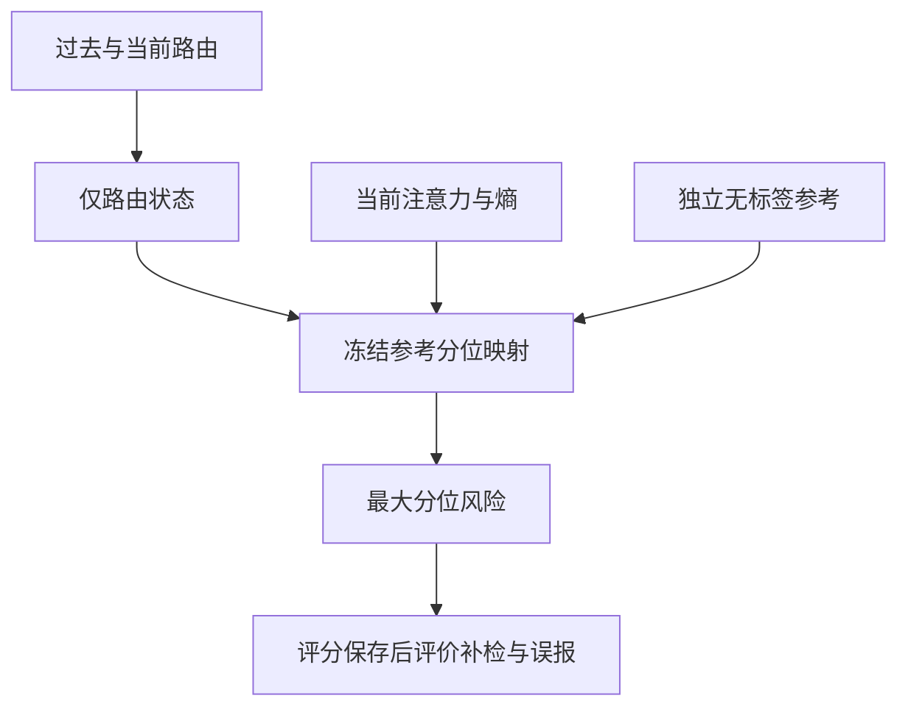

# 直接风险融合：保留持续路由，让当前观测进入风险读出

2026-09-23。无自然标签训练，无 LLM 干预，不重新采集全量数据。
这是可检验的融合候选，不宣称已有 AUROC 增益、发现重锚机制或形成论文创新。

## 32 答结果对设计的约束

用户提供的 RAGTruth QA/test/llama-2-7b-chat 结果，observer 为 Llama-3.1-8B-Instruct：
32 答、7,176 token、604 错误、28 个片段起点、11 个每答首错；16 个独立参考 source。
同一次日志中的两个 JSON 完全相同，不是两次独立验证。

| 方法 | 全错误 AUROC | AP | 每答首错 AUROC |
|---|---:|---:|---:|
| routing_imbalance | 0.711589 | 0.185622 | 0.528260 |
| route_mean | 0.698374 | 0.176310 | 0.417916 |
| route_state | 0.716870 | 0.227373 | 0.487550 |
| joint_state | 0.713602 | 0.215573 | 0.497054 |
| joint_observed | 0.712972 | 0.213283 | 0.507345 |
| attention_displacement | 0.680907 | 0.141573 | 0.561846 |
| entropy | 0.605501 | 0.119305 | 0.771883 |

1. 四答的固定均值优势没有推广；不能继续只以它为主要比较对象。
2. route_state 的全错误 AUROC/AP 增量为 +0.005281/+0.041751；不能称强 AUROC 增益。
3. 联合状态不如仅路由状态，去先验收缩也没有改善总体排序。
4. R/A 在参考数据的相关系数约为 0.980。相关性不证明没有条件增量，但不支持简单重复计权。
5. 576/604=95.36% 错误 token 是延续。总体指标不能代替首错指标。
6. 三种观测在不同端点领先，不能据此推断融合一定有效。

这些是生成器回答在 observer 下回放的关联结果，不能解释为生成器本身的内部因果机制。
此后在这批32答上迭代的方法属于开发结果；后续确认必须使用其他 source。

## 一个直接读出的统一结构

v4 输出路由状态的后验均值；A/H 只改变记忆长度。
v6 保留经过比较的单观测 route_state，将三种观测作为不同时间尺度的风险输入：



此处的“持续”由统计状态模型定义，不是金标 span。所有 token 都使用同一个公式；
不在检测时知道首错/延续身份，也不根据句子或金标边界切换检测器。
没有加入第三个语义隐状态或需要自然标签才能确定的状态含义。

参考集每个 source 等权，再在该 source 全部 token 中均匀取样。
对视图 v∈{route_state, attention, entropy}，定义加权经验中秩：

    F_v(x) = Σ_i w_i [1{x_i < x} + 0.5 * 1{x_i = x}]
    w_i = 1 / (参考 source 数 × token i 所属 source 的 token 数)
    u_(t,v) = F_v(x_(t,v))
    S_t = max_v u_(t,v)

三个方向固定为越高越危险。理由是历史检测结果提供了这些方向的关联证据；
它们仍是待验证的检测假设，尤其高熵不等于幻觉。

采用最大分位有三个明确性质：

- 当前高 H/A 可以直接抬高风险，不必先改变路由状态的平均值。
- 低熵不会抵消高路由风险；不要求延续错误一直困惑。
- 完全重复的分位视图不增加分数；不假设三个视图相互独立，也不累乘概率。

它仍会因一个正常的高熵词而产生高分，加入不完全重复的噪声视图也可能伤害排名。
最大值不是完整相关结构学习，也没有神经网络学到头协同，不能称为自动识别约束。
当前只检验直接融合这一步，不能把该简单聚合本身包装成创新。

经验分布用于无监督尾部评分有已有先例：
Li et al., ECOD, https://arxiv.org/abs/2201.00382 。
这里并非复现 ECOD：方向来自当前研究假设，采用来源等权、单侧最大分位及已有因果路由状态。
不把这些分位称为 p 值、幻觉概率或有形式错误率保证的置信度。

## 参考数据与计算边界

仅支持已有 v4 分数和完全 source-disjoint 的外部参考。
默认读取 v4 保存的 reference_output；显式重定位参考目录时仍检查模型、task、generator、
来源定义和已保存的全部参考矩是否一致。不同 target 共用同一映射，不使用本回答的未来分布。
不允许用 leave-one-target-source-out 的混合参考冒充固定部署校准。

参考 route_state 使用和 target 完全相同的 prior、hazard 及滤波公式。
参考先验和经验分位用同一批无标签参考数据，因此这是拟合参考分布上的描述性校准；
不是独立 split-conformal 校准，不提供覆盖率/FPR 保证。参考集也没有筛成全正常样本。
参考选择是否用过标签单独保留在 reference_cohort，不因本阶段不读标签而抹掉选择历史。

目标的全部 v4 方法直接复制，仅参考数据需要 CPU 计算单变量 route_state。
不加载 GPU 模型，不改变原始 R/A 定义，不重复保存目标的 T×T 后验。
state_inputs 只解压需要的标量特征，跳过 head_profile；v3 的完整读取行为保留。
原始逐头缓存不被修改，旧 v1–v5 结果保留。

分数落在参考范围之外会饱和到0或1；饱和与并列可能损失排名信息。
summary 保存 saturated_fusion_tokens，不能隐藏该限制或按测试标签事后调整外推。

## 评价必须同时看增益与代价

主候选 risk_envelope，主基线 route_state；始终保留 routing_imbalance、route_mean、joint_state、
attention、entropy。percentile_route_state 单独评价分位变换，暴露并列/饱和本身的影响。
instant_envelope 使用当前 R 代替 route_state，其他步骤完全相同，
用于检查时序建模是否真的带来增量。不是模型干预实验。

1. 全错误/首错/片段起点/延续/前后半段 AUROC/AP；来源等权和同答排名；逐答结果。
2. 参考集固定95%加权分位，严格大于阈值才告警；同时报告参考告警率与真实评价 FPR。
   95%是已有评估偏好的固定报告点，既不参与分数也不根据本次标签选择。
3. 相对原始路由、仅路由状态：补回错误、丢失错误、新增正常告警、移除正常告警。
4. 每个错误相对正常 token 的中秩差。对错误求平均严格等于 pooled AUROC 差，
   从而可以定位增益或损失来自哪些错误；这不是新的检测分数。
5. 全部首错/片段起点及告警发生变化的 token 保存文本上下文和主导视图（保留并列）。
   上下文只供人工审计，可以含后文；它不进入评分。

标签仅在全部分数、分位映射和阈值落盘后打开。分数或阈值不因标签变化而变化。
不自动选赢家、不报无样本支持的显著性、也不承诺 AUROC 上升。

## 一键复用当前32答

```bash
git pull --ff-only origin main
python -u main.py support --stage fuse \
  --output outputs/native_support_validation32/test
```

仅使用已有缓存。默认参考路径为之前验证时保存的 outputs/native_support_validation32/reference。
`--stage evaluate` 优先补评同窗口已完成的 v6；旧阶段仍可显式运行。

新输出：`outputs/native_support_validation32/test/risk_fusion_v6/w16/`。

| 文件 | 内容 |
|---|---|
| report.html | 所有基线排名、补检代价和逐词三个分位 |
| summary.json | 简洁总体结果、增量、补检/误报以及饱和数量 |
| evaluation.json / comparisons.json | 同答/来源等权/分阶段的完整排名评价 |
| complementarity.json / alarm_changes.csv | 固定阈值表现、逐词补回与误报及首错审计 |
| reference_distributions.npz / reference_scores.npz | 冻结的无标签经验映射及参考来源身份 |
| responses/0000/scores.npz | 原基线、新风险分数、三个分位和主导视图 |

本地软件验证仅使用合成小缓存和小型随机模型的已有集成测试。
没有当前7176个token的实际缓存，未运行 v6 的自然 AUROC；不得将合成测试当作新检测成绩。
