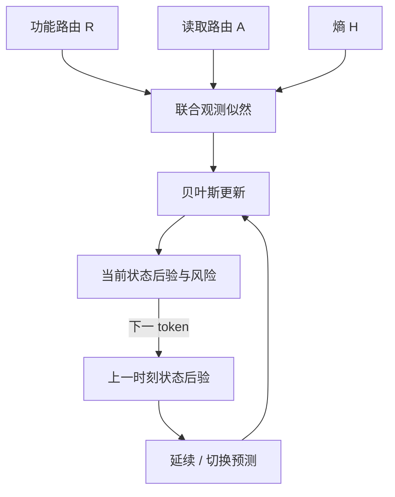

> 历史研究记录：对应评分实现已退出当前主线；需要复现时查看 Git `9d4ba17`。当前实现见 [VALUE_PATH_TRANSPORT.md](VALUE_PATH_TRANSPORT.md)。

# 多观测切换状态模型：风险方向与记忆长度分开推断

2026-09-22。本轮目标是把已有效的功能路由、attention 路由、熵和连续性纳入同一个概率模型。
不把不同检测器的 AUROC 当作可相加权重，不用自然幻觉标签训练或选择参数。

## 为什么需要这个结构

同一四答、836 token 的已报告结果：原功能路由 AUROC/AP=0.754983/0.199373；
普通因果均值=0.779200/0.191355；逐头状态滤波=0.777385/0.199426；
合并头滤波=0.776306/0.214630。逐头 Hellinger 加权没有超过普通均值的 AUROC。
attention 的段起点 AUROC=0.851214，熵的每答首错 AUROC=0.924503，但只有三个起点、两个首错。
这些数字支持检验不同信号的不同作用，不足以确定最优组合或创新机制。

目标是同时估计：(1) 当前功能路由偏向；(2) 当前统计状态已经持续多久。
R 决定风险方向。A 和 log(1+H) 与 R 一起决定旧状态还能否解释当前观测。
高熵本身不是幻觉；低熵也不清零历史风险。观测改变不是语义 reanchor 的认证。

## 完整概率模型

每个预测位置输入 x_t=[R_t,A_t,log(1+H_t)]。沿用已有缓存的原始 R/A 公式和符号。
不增加模型前向，q=P+t-1；当前待预测 token 尚未作为输入。

潜变量 n_t 是包含当前 token 的统计段长度，n_t=1 表示在当前观测之前发生切换。
段内 x_t ~ Normal(mu,Sigma)，mu,Sigma 使用 Normal-Inverse-Wishart 共轭先验。
完整 3×3 协方差建模 R/A/H 的相关性；不把相关指标作为独立证据重复相乘。
参数积分后，预测分布是多元 Student-t。模型比较延续与切换的预测概率：

    q_t(1) ∝ h p_0(x_t)
    q_t(n+1) ∝ (1-h) q_(t-1)(n) p(x_t | 当前长度为 n 的过去段)
    S_t = Σ_n q_t(n) E[mu_R | x_(t-n+1):t]

各分支共同归一；首 token 强制新段。h=1/16 是沿用旧窗口尺度的先验，并非金标边界。
保留所有可能长度，没有 16-token 截断或强制重置；本回答推断不访问未来观测。
变点发生在当前观测之前，因此 q_t(1) 依赖数据；不能将经典“观测之后变点”的恒定 hazard
后验误写成已检测到边界。

NIW 使用 kappa_0=1（一个先验观测）、nu_0=d+2、Psi_0=参考协方差。
因此先验 E[Sigma]=参考协方差。协方差加相对 trace 的 1e-6 对角项用于数值稳定。
这些是固定建模假设，不是从四答 AUROC 拟合的超参数。

S 是功能路由潜在均值的后验期望，不是经校准的“幻觉概率”。A/H 影响分段后验，
不会单独作为正向风险项。模型没有学会来源适用性，也不读出事实真值或声称恢复头协同。

## 数据与参考分布

默认用输入集合中其他 source 的无标签观测估计先验均值和协方差，各 source 等权。
同 source 的所有回答一起排除；目标回答未来 token 不进入自己的先验。
这属于 source-held-out 小样本诊断，不是独立外部训练集，不能冒称严格部署实验。
不同回答的分数不相互递推。缺少独立 source 时直接报错，不能偷用目标回答校准。

可用 --reference-output 指定另一份已采集缓存。它的模型、task、generator、来源定义须一致，
并排除与目标同 source 的数据。参考统计在目标推断之前保存，标签只在全部分数保存后打开。
外部参考模式用于后续冻结部署；本轮不启动全量采集或额外神经网络训练。

## 可解释输出与固定对照

每词保存完整段长度后验、切换概率、期望段长度、三个状态均值和 R 状态不确定性。
还把 S 精确拆为“新段分支贡献 + 延续分支贡献”，避免将概率变化描述成未经测量的机制。
首 token 的切换概率为 1 是初始化，不是检测发现。
observation_nll 是观测向量的预测负对数密度，不是 LLM 输出 token 的惊讶度；密度可大于 1，故它可为负。

主候选 joint_state；对照为原 R、普通均值、原 A、熵、route_state（同模型只观察 R）、
instant_state（同一先验，每词独立更新）。比较 joint_state 相对 mean、route_state、instant_state
的差值分别检查已有强基线、多观测增量和时序增量。对照仅计算检测器，不干预 LLM。
同时报告同答/来源等权、首错/段起点/延续/前后半段及恢复位置；不自动选择胜者。

## 实现与理论来源

核心是 Bayesian online changepoint detection 的共轭消息传递框架；采用当前观测前切换的约定。
Adams & MacKay, 2007: https://arxiv.org/abs/0710.3742
原论文: https://lips.cs.princeton.edu/pdfs/adams2007changepoint.pdf
这一标准概率框架本身不是本文创新。待检验的设计是检测信号分工及其对幻觉排序/进入/退出的作用。

入口：python -u main.py support --stage model --output outputs/native_support_ragtruth4
复用 route_filter_v3/features；新结果写 joint_state_v4/w16，旧入口及全部旧结果保留。
每答复杂度 O(T² d³)，d=3；仅 CPU 小矩阵，输出的后验表 O(T²)。不重读已有大缓存。
本轮没有新的自然 AUROC，软件正确性与自然数据效果分别记录。
