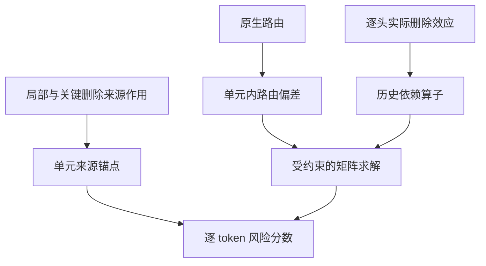

# 统一来源、路由与历史依赖的检测读出

2026-09-24。入口：`main.py transport-unified`。这是已经实现的 CPU 缓存读出，
固定主候选为 `unified`，不根据评价自动切换到某个消融。支持完整 carrier v1/v2 目录和 ZIP。

## 1. 原主线缺少什么，本版改变什么

之前的流程为：原生采集 → 每 token 的有限干预表征 → 分别计算来源 logp、margin、路由 → 各自评价。
v2 的7190维向量被保存，但没有一个联合模型把它转换为风险；原始路由仅作为对照。
因此“保留了路由基线”不能说成“新主线已经使用了路由信息”。

本版实现一个无自然标签训练的结构化评分模型，不是另训 GNN 或真假分类器。
局部与关键删除来源作用负责单元尺度，路由负责单元内差异，逐头有限效应负责依赖约束。
所有模块参与最终 `unified`，独立分数用于消融和解释。
旧入口、旧缓存和兼容字段 `risk=raw_route` 保留；新入口的主结果明确为 `unified`。
当前并未使用7190维向量的全协方差或学习各物理头的权重，不能冒称完成了高维表示学习。

用户已返回真实 v2 单独读出的结果：choice_selected=.588243/.120978，
token_source_selected=.644461/.149906，后者单元均值=.844641/.424071（AUROC/AP）。
“尚无v2联合成绩”仅指本联合入口缺少其完整缓存，不能再把用户已经跑完的v2采集说成未运行。



这不是模型原生的语义层次图。文本单元沿用无标签标点/长度划分，不能叫自动发现的 claim 或 reanchor。

## 2. 来源锚点：整段是否缺少来源约束

对每个原文本单元 U，先在原生单位中计算两种来源风险均值：

\[
a_U=\operatorname{mean}_{t\in U}[-\Delta_S\log p_t]_{local},\qquad
b_U=\operatorname{mean}_{t\in U}[-\Delta_S\log p_t]_{selected\ cut}.
\]

第一种减少完整远历史的遮蔽，第二种只删除已选历史消息；这是两种历史条件下的来源作用，
不把 margin、entropy、attention 等所有现有指标都加成新的独立证据。
两个来源读出相关，所以先归为一个来源组，再固定等权组合，不让它们各占一份路由权重。

用无标签参考集的 source-balanced empirical mid-CDF 分别转换到共同尺度：

\[
s_U=\tfrac12\{F_a(a_U)+F_b(b_U)\}.
\]

每个 source 在各尺度中的总参考质量相同：长回答或同来源多回答不会得到更多参考权重。
来源尺度按单元计数，路由尺度按 token 计数；相同数值使用同一个中间秩。
这是分布尺度统一，既不是正常分布建模，也不是幻觉概率校准。
局部来源与关键删除来源的等权是冻结的设计选择，不是标签学习到的最优权重。

默认用当前无标签 cohort 作参考，因此是 transductive/offline 分数，添加新样本会改变尺度。
可用 `--reference` 指定同测量版本、与目标来源不重叠的完整 carrier 缓存，保存固定外部参考。
按任务/生成器分别运行；本入口不会自动把混合任务分布分开，不能据四答尺度声称跨任务泛化。

## 3. 路由分辨率：保留 token 差异而不过度重复单元背景

令 `r_t=F_R(raw_route_t)`。取每个单元内部的路由偏差：

\[
v_t=r_t-\operatorname{mean}_{i\in U(t)}r_i.
\]

来源负责单元整体位置，路由补充同一单元内的相对差异。这样的职责分配有意避免
完整回答后部的共同路由抬升直接覆盖来源尺度。
它会舍弃路由的单元间均值信息，这是明确取舍，不是假称消除了全部位置混杂。
`flat_fusion=(s_U+r_t)/2` 保留为固定对照，检验这个分层设计是否胜过直接相加。

## 4. 历史依赖：从逐头有限效应建立约束

对每个已测物理层/头消息 e，保存双来源单删 logp 效应：

\[
D_e^c(t)=\log p_{keep}^c(y_t)-\log p_{cut(e)}^c(y_t),\quad
m_e(t)=|D_e^+(t)-D_e^-(t)|.
\]

先对每个物理头独立计算交互绝对值，再建立连接，不先平均 attention 或有符号效应。
作用方向相反的两个头不会在取绝对值之前抵消。原始符号和头身份在 `edges.npz` 中保留。
图的线性算子最终会累加同端点的平行边，因此它没有学习不同头的身份权重或高阶协同。

每个 target 到历史 key 的定向权重为：

\[
W_{tj}=\frac{\sum_{e:key(e)=j}m_e(t)}{1+\sum_e m_e(t)}.
\]

分母的1是固定的一 nat 效应尺度。弱效应不会因行归一化变成总质量1。
随后取 `S=(W+W.T)/2`，按 `max(degree,1)` 的平方根缩放两个端点，限制高入度节点主导；
不放大小于1的弱总质量。缩放后的邻接为 A，使用组合 Laplacian `L=diag(A1)-A`。
这是离线依赖正则化；对称化不意味着原生信息流是双向，也不是 attention sink 的语义识别。

v1 的每条消息在整个单元 query 上删除，其逐 token 效应是 bundled intervention；
记录 `receiver=-1`，不能伪装成当前 query 的单边作用。
v2 使用实际保存的 `(layer,head,receiver,key)`，保留较早 receiver 身份。
未测边没有约束，不代表它真实没有作用。消息依赖也不证明两个 token 的真假相同。

随机图控制保留每条入选边的权重/头/目标，改用缓存中匹配的 sham key，
检验端点结构；它不是重新测量随机边的有限效应，也不是能量/距离完全匹配。

## 5. 一个明确的矩阵目标

令 B 把逐 token 数值转换为各单元均值。求路由修正 δ：

\[
\delta^*=\arg\min_{B\delta=0}
\frac12\|\delta-v\|_2^2+\frac\lambda2\delta^TL\delta,
\qquad z_t=s_{U(t)}+\delta_t^*.
\]

第一项保留观察到的相对路由变化，第二项检验相连节点的路由偏差能否共同去噪；
`Bδ=0` 保证图更新不漂移来源锚点。平滑作用于相对路由偏差，不直接传播“这个节点是错的”。
依赖边上的偏差平滑仍是研究假设，需要真实图/随机图和无图对照验证。
默认 λ=1，在评价前冻结；没有网格搜索、标签拟合或自动挑选主候选。

通过一个稀疏线性系统求解，整个回答的 token 一起处理：

\[
\begin{bmatrix}I+\lambda L&B^T\\ B&0\end{bmatrix}
\begin{bmatrix}\delta\\\nu\end{bmatrix}
=\begin{bmatrix}v\\0\end{bmatrix}.
\]

`I+λL` 正定，单位区间互不重叠使 B 满行秩，所以约束问题有唯一解。
不构造密集全图逆矩阵，不增加大模型前向/反向。
z 是排序分数，可以超出 [0,1]，不能直接解释成幻觉概率或用0.5当事实阈值。
本版的单元均值严格等于 s；保存精确锚点作 `*_unit_mean`，避免数值误差打破理论上的并列。

硬约束的局限也很具体：路由和图无法纠正错误的单元平均来源分数，只能改变单元内分布。
如果来源漏标/来源不适用、文本单元跨越多个事实，这种约束可能错误。没有结构定理保证检测收益。

## 6. 固定组件消融和实际缓存结果

| 分数 | 与完整模型的区别 |
|---|---|
| `unified` | 两种来源锚点 + 路由偏差 + 真实消息图 |
| `unified_no_graph` | 不正则化路由偏差 |
| `unified_local_anchor` | 来源锚点只用 local；路由/图不变 |
| `unified_random_graph` | 仅替换历史 key 端点，保留权重 |
| `source_consensus` | 只保留来源锚点，即移除路由偏差 |
| `flat_fusion` | 直接等权来源锚点与未中心化路由 |

下表是本轮已在用户上传 **v1** 完整缓存上实际运行的结果，4答/836 token/81标错。
不是 v2 原生缓存的结果；v2 目前只有用户提供的汇总指标，不能据它们计算组合排名。

| 方法 | token AUROC | AP | 答内对加权 AUROC |
|---|---:|---:|---:|
| unified | .877475 | .356279 | .918907 |
| 去图 | .872864 | .362126 | .913232 |
| 只用 local 来源锚点，保留路由/图 | .890164 | .407222 | .905541 |
| 随机端点图 | .878227 | .356419 | .921670 |
| 仅两来源锚点 | .902085 | .451852 | .962963 |
| 直接等权融合 | .872880 | .384611 | .913008 |
| 原始 route | .755425 | .199692 | .747461 |
| 原始 local 来源单元均值 | .914856 | .451496 | .957736 |
| 原始 v1 selected 单元均值 | .855973 | .340470 | .949373 |

完整模型高于原始 route，但没有胜过最强 local 来源基线。
真实图与随机图近似持平，不能据 .0046 的无图 AUROC 增量宣称拓扑有效，且 AP 下降。
仅来源组合的 AP 比 local 高 .000356，不构成实际提升证据；AUROC 反而降低。
去掉路由偏差更好，说明在这批样本里增加 token 波动没有带来收益。
此前41个单元均标签齐性，不能用它证明或否定混合单元内部定位能力，但总体退化必须记录。

这次实验表明已经把组件放进同一推理模型，不表明组合天然胜过单组件。
不根据这些结果调权重再把同四答最高值包装成新的确认结果，主候选记录不改名。

## 7. 运行、输出与可用时间

```bash
git pull --ff-only origin main &&
bash experiments/native_support/run_unified.sh
```

默认直接读已完成的 `message_carriers_token_v2`，不加载8B，写独立 `unified_route_source_v1`。
使用上传 v1 或其他缓存：

```bash
python main.py transport-unified --input PATH_TO_CARRIER_DIR_OR_ZIP \
  --output outputs/unified_other --graph-strength 1 --resume
```

`--stage score` 重新读缓存计算；`--stage evaluate --output DIR` 只评价已冻结分数；
`--stage pack --output DIR` 重新打包。协议变化必须换目录，不在原缓存上覆写。
所有答案完成评分后才读取标签。固定分数后评价 token/首错/延续、答内/跨答、
单元等权、同单元定位和整单元预算。组件均值不是另一轮独立模型选择。

输出包括：

- `scores.npz`：原始分数不变，新增联合模型与固定消融。
- `components.npz`：路由尺度、两个来源锚点、中心化路由及真实/随机图修正。
- `edges.npz`：逐头双条件有限效应、原/随机端点和真实 receiver 身份。
- `calibration/*.npz`：无标签参考经验分布；`calibration.json` 保存参考来源。
- `diagnostics.json`：约束误差、方程残差、图规模、图改变量和来源视图差异。
- `evaluation.json`、`ranking_scope.json`、`comparisons.csv`、`aggregation.png` 及自动 `_review.zip`。

图推理依赖完整回答，默认尺度还依赖完整参考 cohort，因此是离线检测。
新方法在 `span_availability.csv` 标记 `completed_answer_and_reference`，不把单元末尾当作
真实在线报警时刻；`earliest_score_delay` 为未定义，事后 onset 命中仍独立报告。

## 8. 依据与验证范围

[Lookback Lens](https://aclanthology.org/2024.emnlp-main.84/) 使用逐头 context/history 比值并训练线性分类器，
支持把路由当有用观测，但不证明本无监督组合的权重或准确性。
[图信号处理综述](https://arxiv.org/abs/1211.0053) 与
[图信号插值的保真/平滑正则化](https://arxiv.org/abs/1310.2646) 提供图正则化的数学工具；
不能据通用平滑理论宣称幻觉状态服从该图。有限梯度/删除测量仍沿用 carrier 协议及其局限。

软件验证覆盖来源等权/并列秩、零图退化、稀疏KKT约束、相反头效应不提前抵消、
v1/v2效应轴和receiver区别、两个真实小模型缓存流水线、标签隔离、原缓存不变、
外部参考来源互斥、离线可用时间及固定参数续跑检查。未运行新的8B采集或全QA确认实验。
