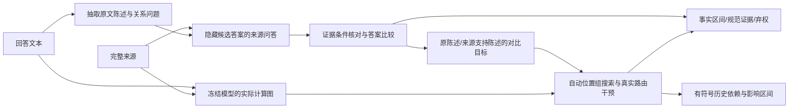

# 完整修订方案：来源约束与生成计算的对齐审计

2026-09-13，结构修订1。初稿和6.22分审查保留。此文是待复审的方法，不是训练或检测结果。

## 问题锚点

对冻结LLM，在不以幻觉标签训练的条件下，测量来源和历史的信息实际传递、聚合与输出采纳；区分疑似错误被继续沿用、被反对/纠正以及新陈述开始。事实区间和影响范围分别评价，熵只提供候选起点。

## 对审查的取舍

接受：两个自由学习头+潜在证据集合+自由半马尔可夫分段没有足够监督，删除这些首版训练任务。所有LLM冻结，首版无新训练权重；有限干预是算法，不训练一个尚无可靠目标的替代网络。
接受：规范证据做支持性核查，生成图做采用、位置组和条件影响核查。主贡献是**识别有可核查内部路由证据的不支持陈述**，不宣称仅看 native 图就能识别事实真假。
修改：QA锚点比从零训练三类语义头更可审计。它仍可出错，因此保存问题、隐藏答案的来源回答、完整条件引文和弃权；它是模型估计，不能作为独立评价真值。
拒绝扩张：不加入AMR解析器、Graph Adapter、跨层SAE、额外GNN或训练式分段器。先完成一个可运行的图推断方法。若精确测量吞吐成为已测瓶颈，再只蒸馏联合干预效应作加速，不改变判定定义。

## 1. 核心结构与模型选择

固定使用已在本机的 Qwen3-8B 作语义读者，Llama3.1-8B作 native/observer 计算骨干。二者在单4090分阶段运行，不同时驻留。语义读者不用原生attention、logits或其熵判断正确证据。
语义读者将完整文本自动变成带原文区间的**陈述—约束图**；observer 构成带高维残差、V/O消息及attention关系的**计算图**。通过原文token/字符和证据区间映射建立图间对应。
首版图没有人工关系标签训练，也不以合成真假标签训练；冻结读者预训练本身含监督，不宣传为从原始文本完全无先验学习。

本方法默认完整回答后的自动审计，回溯定位先前节点；不冒称首错前在线预测。完整因果图仍只含每一步当时可见token。未来若做在线版，语义图也必须只看当前prefix，单独评价延迟。

## 2. 固定接口：什么是当前应该使用的证据

### 2.1 陈述与问题

读者仅看 task+response，不看来源：一次生成可重叠的 Claim 及关系问题。每个 Claim 保存 exact_quote、start/end、父句、原文回指区间、predicate、argument/qualifier 的原文区间。阶段、地点、条件、否定、数量/单位都保留为原文约束；未知字段置unknown，不自动补齐。
程序检查每个quote精确对应原文。找不到或多处同文无法唯一定位则弃权，不能挪动到已知错误位置。每个词被明确覆盖、非断言，或标 coverage_unknown；不能只报告抽取成功的好例子。
每个可核实关系生成 question、answer_quote（回答中声称的值/关系）、answer_span、premise_spans。问题中隐藏目标答案，但保留其它必要条件。对关系、动作和阶段也可提问，不限定名词或数字。
读者用**仅原回答**回答该问题并检查能否恢复 answer_quote：这是问题忠实性测试，不是来源真实性测试。失败为 invalid_question，不进入真假判定。

### 2.2 来源问答与证据集

来源读者输入完整D、task和问题；**不接收 answer_quote、完整response、先前真假判断或native选择**。
输出 source_answer、证据引文集合G、引用条件覆盖表及 answerability∈{answerable,not_stated,conflicting,uncertain}。所有引文必须是完整来源的精确子串，并映射到token；不是“模型说来源支持”就接受。
再独立提示核对引文能否覆盖问题全部前提与关系：同数字出现在别的阶段不通过；引文只能支持一部分前提则 partial，不强制答最相似的span。核对仍由冻结读者完成，不视为独立人工真值。
允许多个可替代证据集合：保留每组引用以及支持状态，不把未被引用的来源单位标成负例。不穷举全部幂集，不宣称最小证据集；若只发现一个集合，记 discovered_set，不记唯一。
多句联合证据作为一个集合交给来源问答/核对。不得以各单句得分max替代集合支持；没有发现集合不自动证明全文没有支持。

四种失败分开：not_stated=模型估计全文未说明；uncertain=读者不能确定；invalid_question=问法/前提不可靠；coverage_unknown=没有覆盖该词/断言。NULL仅是第一种的模型估计，后三种为abstain。所有这些状态都保存，不制造一个“确定无证据”的真值。

### 2.3 不支持与最小归因范围

固定比较提示只看问题、回答所称answer、来源answer及经核对的条件证据，输出 E（等价且完整支持）、C（明确不兼容）、N（未说明）、U（不确定）。保存四个标签的条件logits及归一化分数，r=P(C)+P(N)。这个分数不是已校准真假概率。
问题有效且证据条件通过才允许E/C；N需要来源问答与条件核对均为not_stated。其余U。完全同字符串不跳过条件核对。
若所有前提被来源支持、只有目标答案不兼容，可定位answer_span。若问题有一个或多个未支持前提，只定位**整个相关Claim的可疑范围**，不得把若干NULL都归罪给目标槽。报告 `localization=slot|claim|unresolved`。
同一词由多个问题覆盖，保留各分数，不把多数E覆盖一个明确C；输出词级最大有效r，同时单列覆盖次数/U。没有有效核对的词输出score=0.5与abstain=true，参与全覆盖评价，不从分母排除。
固定初版审计阈值r≥0.8，E条件P(E)≥0.8；0.2–0.8和U均记不确定。仅为预注册操作阈值，无80%准确率保证；自然测试只报告固定阈值结果和阈值无关曲线，不按结果调。

## 3. 生成图与当前事实的输出目标

### 3.1 图表示与预算

原生图以(position,layer)为计算节点，高维状态来自真实模型；消息与路由的权重保持head/GQA语义。图是计算组织结构，默认不存完整L×H×T×T数组，不将其训练成图网络。
每个新forward逐层处理：只提取本次gate要求的来源/历史位置和query块，保留原始H/V与O权重身份供复测，处理后释放大attention张量。其余全部上下文仍参与原模型运算；不提取某行不代表切断它。
句/Claim/问题答案的原文区间是上层分组，token节点与跨组连接仍存在。共享一个 source数字的不同事件不合并成一个证据节点。

### 3.2 对比目标优先，文本似然退为依赖诊断

仅对r≥0.8且有可靠规范核对的Claim解释原因。来源语义读者尝试生成一个最小改动且获来源支持的完整替代陈述c*，保留其它含义；重新验证全部条件及原文前提。目标不是把12机械改14。
没有可靠c*时，**不返回 routing_error 因果分类**，只做当前文本依赖诊断并标 `no_semantic_contrast`；不把“删除来源使logp降低”当致错证明。
为保证两条序列是可比较的不同事件，原陈述c与c*都延伸到相同定义的句/分句终止符；若一条仍是另一条token前缀或不能对齐共同prefix，则退出对比。最多两条已核对替代，每条≤96token；超限是coverage限制，不截断后假装完整。
固定共同前缀h，令B为原错误陈述的完整续写，A为来源支持替代的完整续写集合：

F = log P(B|h,D) − log Σ_{a∈A} P(a|h,D).

这是固定有限候选事件的log odds，不做长度平均，不是“所有正确答案”的概率。只在**两分支相同的前缀query**上干预；分歧后的teacher-forcing不同，但同一个gate在两分支作用于相同位置。F改变表示对这些具体陈述的偏好改变。
每条token的logp及F保存；候选、引文、共同prefix与目标在任何gate前冻结。对比偏好不等于自由生成修复。
作为补充依赖诊断，F_text为原Claim词级平均logp，所有词含字母/数字的token参与，排除纯空白/标点。F_text不用于宣称路由致错，避免格式与流畅度主导核心结论。

## 4. 路由与内容 gate 的精确定义

一个group G=(role,evidence_keys,query_set,layers)；role为source或history。默认layers=全部32层，层细分仅在已找到组后作诊断。所有后续网络均重新计算；固定离散历史的条件效应，不是干预后自由续写的总效应。

V gate：在指定query/head的O输入中，只将指定key的实际A_ij v_j乘λ，其它消息不动。它测内容消息贡献。
E gate：在指定query/head，把角色内指定证据key的attention乘λ，再在**该角色内部**重归一到接收状态原来的角色总质量，V不换、角色外连接不动。它测来源内部路由对应；若λ=0删掉该角色全部key或剩余质量为0，该干预invalid，不用epsilon制造有效分布。
λ∈{1,0.5,0}。sham λ=1必须完整logits逐值相同；所有gate前query必须不变。E和V分别出结果，不能把V有效称成E错。
第一版不声称Q或K、MLP单独负责错误。E没有选择性效应而V有，只是内容依赖；正确证据可见但输出错、又没有明确对比路由证书时记 `adoption_unresolved`，不凭排除法命名聚合错误。

## 5. 自动组搜索：不是entropy先选top8

目标域为从回答首query到共同prefix末query的全部位置。source候选为语义图发现的相关证据集合，以及包含原候选值但条件不适用的来源组；后者须通过条件核对。未枚举来源有 `unsearched_source` 记录，不称全覆盖。
每个来源候选的query集合用完整二叉区间树初始化，并允许两个不相邻叶组的并；标点不截断树。组搜索的oracle就是固定F的实际forward，不先训练代理网络。
先测全部query的单来源组；按实测删除效应优先细分。优先队列保留父组和子组，子组单独弱不删除父组，避免漏掉联合效应。允许将已分开的两组再并起来；预算结束保留多个近等价候选。
固定每个回答最多64个**branch forward**（一个两分支对比gate耗2；包括sham/对照/半量/保留复测），最多解释2个风险Claim。先按r与有效slot覆盖排序，平分预算；未解释的Claim保留语义结果与 `budget_unresolved`。这是首版效率覆盖取舍，必须报告解释覆盖分母。

### 5.1 返回组的量与接受标准

对所有query内同角色候选定义Universe U。Δ_del(G)=F(base)−F(gate_G(0))，正值说明G推动坏陈述相对好陈述。
Δ_keep(G)=F(base)−F(gate_(U\G)(0))；这只在明确定义的role/key/query域内保留G，不意味着全模型只剩该组。E的keep若没有可保持角色质量的有效参照，则不报告sufficiency。
对同回答语义图中非重叠、不共享关键前提的已支持Claim作对照，计算相应F_text变化；只有发生在gate之后的对照才有效，不用先于gate的必然0作为特异性证据。无有效后置对照则specificity_unresolved。
预注册操作阈值：τ_eff=0.5 log-odds，ε_keep=0.25，γ=0.25；均非真实性概率。半量Δ与全量同号、且|Δ_half|≤2|Δ_full|才记sign_stable，异常非线性保留原数值并拒绝证书。
`contributory`：Δ_del≥τ_eff、sign_stable且特异性通过。
`sufficient_within_U`：另满足|Δ_keep|≤ε_keep；若keep invalid不伪造通过。
`routing_witness`必须是E的contributory或sufficient，V仅能给content_witness。搜索家族中所有已测试的真子组均未满足同标准，才称 `minimal_within_tested_family`；预算不足不用全局minimal字样。多个组可同时返回并标non_unique。
特异性量纲目前用对照文本logp不同于主log-odds，需在下一轮复审确认是否应改为同类对比对照；不隐去这个未闭合点。

## 6. 路由衍生、错误延续、纠正的可执行规则

`unsupported(c)`：有效语义核对r≥0.8，且不是U/invalid/coverage缺失。
`routing_supported(c)`：unsupported(c) 且存在实测routing_witness，证据组的对象/动作/阶段与当前所需约束不匹配或明确矛盾。标签全称是 **observer固定历史下、对指定语义对比有路由支持的不支持陈述**；不缩写成普遍幻觉成因已证。
若只有content_witness或F_text效应，只标内容依赖；没有可验证对比或预算不足保留unresolved。

Claim关系由语义读者输出 same_claim/elaboration/correction/new_claim/unknown，必须引用当前及此前原文；无引用、标签冲突为unknown。同证据不等于同Claim。
候选错误延续须同时满足：h与c均unsupported；关系same_claim或elaboration；h→c历史E/V gate对当前坏/好陈述对比有正效应证书。强历史依赖不足以继承标签。
纠正须当前c获来源支持且关系correction；它可以正向依赖此前错误文字，不强制历史Δ为负。若要称“抑制旧错误”，必须另定义旧命题复述vs当前正确命题的对比，不能混用两个F的符号。
新Claim即开新分组，source/history长边仍保留；主题相同也可有多个独立Claim，主题不同不自动抹去跨段依赖。

事实区间来自slot/Claim的语义核对；条件影响区间来自对后续各Claim的固定历史干预。两套边界、覆盖率和uncertain分开返回；不把RAGTruth标注边界当因果影响真值。

## 7. 推理顺序与产物

阶段A（Qwen、一次批处理）：自动Claim/问题、自洽、全文来源回答、条件核对、答案比较、可靠替代陈述。所有语义缓存落盘，并保存模型/提示/输入哈希和U原因。
阶段B（Llama、一次批处理）：自动共同prefix与图映射、baseline/sham、按固定预算搜索组、输出证书。不得把阶段A的结论当独立评价真值。
阶段C（CPU）：图上分组与两类区间输出。JSON每回答覆盖原文所有词；每Claim含source证据、Q/A、r、slot/claim范围、native/observer、contrast、组列表、E/V、Δ值、certificate/abstain/budget状态、历史关系。

主线模块放graph：evidence_anchor.py、constraint_graph.py、causal_groups.py、grounded_audit.py。reanchor只提供原生Llama gate/oracle与重放。首版不需要训练脚本；训练式加速是以后可删除的组件，不是当前完整性前提。

## 8. 验证与资源门槛

不再运行O6单来源行为对照。下一次GPU任务必须运行上述完整输入→自动语义→自动位置组→span输出链条，先在按source hash冻结的自然RAGTruth开发来源完成所有样本；不能手工给错误位置或12/14候选。
开发来源来自官方train，先只读split/source_id元数据划分，含QA/Summary/Data2txt。调试指标与既看过QA test均探索性；确认性评估在结构/阈值冻结后另用新来源/外部数据。自然标签仅独立评价，不供语义读者/搜索/配置选择。
主比较：同一个语义锚点（无计算图）vs完整路由审计，分别评价不支持检测、路由解释覆盖/特异性、错误延续与纠正误报；若图仅增加解释，不声称提升事实检测AUROC。另以固定entropy/RAUQ作廉价基线。
资源：Qwen只生成有长度界限的JSON/问答；语义调用数随自动Claim数计入，超限弃权而不丢样本。Llama每回答≤64branch前向，比现有8条件全量更贵；先测完整自然batch的真实延迟/显存，再决定全量预算。没有凭空给6–16小时承诺。
原全量17790任务继续且冻结；新审计调度需要独占并自动恢复，不混同目录。工程检查和方法审查不能替代真实自然数据有效性。

## 当前仍需复审的实质问题

特异性对照必须同量纲；有限语义替代不能代表全部正确表达；未发现支持集与实际缺失不同；错误前提造成的定位歧义必须保留。语义锚点决定事实检测上限，图的额外贡献须由路由/衍生评价体现；严格全覆盖/100%节点定位不是可以从结构保证的性质。
