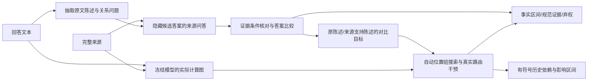

# 完整修订方案：约束条件下的消息采用与回看组定位

2026-09-13，结构修订2。初稿、6.22/6.90分审查及上一完整方案保留。此文是待复审的方法，不是训练或检测结果。

## 问题锚点

对冻结LLM，在不以幻觉标签训练的条件下，测量来源和历史的信息实际传递、聚合与输出采纳；区分疑似错误被继续沿用、被反对/纠正以及新陈述开始。事实区间和影响范围分别评价，熵只提供候选起点。

## 对审查的取舍

接受：两个自由学习头+潜在证据集合+自由半马尔可夫分段没有足够监督，删除这些首版训练任务。所有LLM冻结，首版无新训练权重；有限干预是算法，不训练一个尚无可靠目标的替代网络。
接受：规范证据做支持性核查，生成图做采用、位置组和条件影响核查。主贡献是**识别有可核查内部路由证据的不支持陈述**，不宣称仅看 native 图就能识别事实真假。
修改：QA锚点比从零训练三类语义头更可审计。它仍可出错，因此保存问题、隐藏答案的来源回答、完整条件引文和弃权；它是模型估计，不能作为独立评价真值。
拒绝扩张：不加入AMR解析器、Graph Adapter、跨层SAE、额外GNN或训练式分段器。先完成一个可运行的图推断方法。若精确测量吞吐成为已测瓶颈，再只蒸馏联合干预效应作加速，不改变判定定义。

## 范围检查与主贡献

用户要解决的三个缺口不变：自动回看位置、信息路由后错误的延续、当前证据的条件归属。首版采用可错的冻结语义读者锚定“应当使用什么”，用生成器内部图测“实际使用什么”。**这不是已经证明仅靠生成器内部即可区分事实归属**。后者保留为未解决的科学问题，不能用QA性能替代。我们实现的是完整的、没有自然幻觉标签训练的离线审计方法；不把它命名为已成功的纯内部无监督检测器。

主贡献假设只有一个：条件化于可检查的证据锚点，自动搜索原生图中的消息组，其实际干预效应能够区分当前具体错误承诺、错误历史沿用与正确纠正。QA本身是复用模块和强基线，不声称新增事实核查架构。若图只能增加少量案例解释，这个假设失败；不能靠更名宣称收敛。

## 1. 核心结构与模型选择

固定使用已在本机的 Qwen3-8B 作语义读者，Llama3.1-8B作 native/observer 计算骨干。二者在单4090分阶段运行，不同时驻留。语义读者不用原生attention、logits或其熵判断正确证据。
语义读者将完整文本自动变成带原文区间的**陈述—约束图**；observer 构成带高维残差、V/O消息及attention关系的**计算图**。通过原文token/字符和证据区间映射建立图间对应。
首版图没有人工关系标签训练，也不以合成真假标签训练；冻结读者预训练本身含监督，不宣传为从原始文本完全无先验学习。

本方法默认完整回答后的自动审计，回溯定位先前节点；不冒称首错前在线预测。完整因果图仍只含每一步当时可见token。未来若做在线版，语义图也必须只看当前prefix，单独评价延迟。

## 2. 固定接口：什么是当前应该使用的证据

### 2.1 陈述与问题

读者仅看 task+response，不看来源：一次生成可重叠的 Claim 及关系问题。每个 Claim 保存 exact_quote、start/end、父句、原文回指区间、predicate、argument/qualifier 的原文区间。阶段、地点、条件、否定、数量/单位都保留为原文约束；未知字段置unknown，不自动补齐。
程序检查每个quote精确对应原文。找不到或多处同文无法唯一定位则弃权，不能挪动到已知错误位置。每个词被明确覆盖、非断言，或标 coverage_unknown；不能只报告抽取成功的好例子。
每个可核实关系生成 question、answer_quote（回答中声称的值/关系）、answer_span、premise_spans。问题中隐藏目标答案，但保留其它必要条件。对关系、动作和阶段也可提问，不限定名词或数字。
读者用**仅原回答**回答该问题并检查能否恢复 answer_quote：这是问题忠实性测试，不是来源真实性测试。失败为 invalid_question，不进入真假判定。

### 2.2 来源问答与证据集

来源读者输入完整D、task和问题；**不接收 answer_quote、完整response、先前真假判断或native选择**。
输出 source_answer、证据引文集合G、引用条件覆盖表及 answerability∈{answerable,not_stated,conflicting,uncertain}。所有引文必须是完整来源的精确子串，并映射到token；不是“模型说来源支持”就接受。
再独立提示核对引文能否覆盖问题全部前提与关系：同数字出现在别的阶段不通过；引文只能支持一部分前提则 partial，不强制答最相似的span。核对仍由冻结读者完成，不视为独立人工真值。
允许多个可替代证据集合：保留每组引用以及支持状态，不把未被引用的来源单位标成负例。不穷举全部幂集，不宣称最小证据集；若只发现一个集合，记 discovered_set，不记唯一。
多句联合证据作为一个集合交给来源问答/核对。不得以各单句得分max替代集合支持；没有发现集合不自动证明全文没有支持。

四种失败分开：not_stated=模型估计全文未说明；uncertain=读者不能确定；invalid_question=问法/前提不可靠；coverage_unknown=没有覆盖该词/断言。NULL仅是第一种的模型估计，后三种为abstain。所有这些状态都保存，不制造一个“确定无证据”的真值。

NULL分层：`reader_not_stated`仅是读者判断；`searched_family_none`指发现的候选集合中没有通过核对者；二者均不叫global absence。首版全文在上下文限额内才进入来源核查，超限明确coverage_partial并弃权；不截断。N升为可用估计需全文阅读、两种固定问法一致、逐来源单元条件核对没有留下未定的相关候选；仍是模型估计，并单列N准确率。字符串存在某数值不是存在适用答案，因而不接受“有同数值就禁止N”的建议。

### 2.3 不支持与最小归因范围

固定比较提示只看问题、回答所称answer、来源answer及经核对的条件证据，输出 E（等价且完整支持）、C（明确不兼容）、N（未说明）、U（不确定）。保存四个标签的条件logits及归一化分数，r=P(C)+P(N)。这个分数不是已校准真假概率。
问题有效且证据条件通过才允许E/C；N需要来源问答与条件核对均为not_stated。其余U。完全同字符串不跳过条件核对。
若所有前提被来源支持、只有目标答案不兼容，可定位answer_span。若问题有一个或多个未支持前提，只定位**整个相关Claim的可疑范围**，不得把若干NULL都归罪给目标槽。报告 `localization=slot|claim|unresolved`。
同一词由多个问题覆盖，保留各分数，不把多数E覆盖一个明确C；输出词级最大有效r，同时单列覆盖次数/U。没有有效核对的词输出score=0.5与abstain=true，参与全覆盖评价，不从分母排除。
分别保存r_contra=P(C)、r_missing=P(N)，合成r仅供不支持候选排序。固定初版审计阈值r≥0.8，支持条件P(E)≥0.8且核对有效；不满足两项之一或为U均记不确定。仅为预注册操作阈值，无80%准确率保证；自然测试只报告固定阈值结果和阈值无关曲线，不按结果调。

## 3. 生成图与当前事实的输出目标

### 3.1 图表示与预算

原生图以(position,layer)为计算节点，高维状态来自真实模型；消息与路由的权重保持head/GQA语义。图是计算组织结构，默认不存完整L×H×T×T数组，不将其训练成图网络。
每个新forward逐层处理：只提取本次gate要求的来源/历史位置和query块，保留原始H/V与O权重身份供复测，处理后释放大attention张量。其余全部上下文仍参与原模型运算；不提取某行不代表切断它。
句/Claim/问题答案的原文区间是上层分组，token节点与跨组连接仍存在。共享一个 source数字的不同事件不合并成一个证据节点。

### 3.2 两类语义对比，完整事件计分

A. `grounded_replacement`：当前问题为明确C，来源给出带完整条件的答案。只允许将answer_span替换为source_answer的精确引文；保留其它原字符，保存edit script。重新检查语法、全部前提和语义，不能通过则`contrast_requires_rewrite`。不让模型自由改写阶段或谓词后自证修好。
B. `withholding`：对于读者估计的N，不制造一个“正确数字”。为目标槽使用按语义类型固定的非承诺表达（duration: `an unspecified duration`; number: `an unspecified number`; entity: `an unspecified entity`; 未覆盖类型弃权）。保存完整替换脚本；若替换不合语法或改变目标槽外断言则无效。这只是**具体承诺相对不作具体承诺**的对比，不是来源支持答案，不叫事实修复。缺失判断仍依赖弱语义锚点。该类别单独评价，不能与A混报。

原事件B及替代事件A均保留同一原文终止边界，不超过96token；超限弃权。两者都在任何干预前确定，确定性tokenization后寻找完整公共前缀h；拒绝重复/互为前缀的事件。第一版只用一个A，避免不断添加说法改变分母。

F_G = log P_theta,G(B|D,h) − log P_theta,G(A|D,h).

`G`只改变公共前缀中的query节点，节点输入token完全相同；没有在分歧后的query上加新gate。两条分支都重新计算真实后缀网络，允许后缀attention/RMS/MLP不同。**不同后缀不使这个定义失效**：同一前缀干预改变了两个指定序列事件的概率比；它不说明后续每个生成节点都被解释，更不等于自由生成一定修复。拒绝把核心目标退化成首个数字/token，因为用户要研究多token约束与连续span。

每条记录保存`query_scope=shared_prefix_only`、两条完整input_ids、共同prefix长度、各branch gate位置（完全相同）及逐token logp。若采用不同分支长度，仍计完整序列概率，不做长度平均。实现初版已在`route_graph/causal_contrast.py`定义该量；该模块不是检测器。
F_first保存首分歧token的log-odds，仅诊断首步与后续偏好的差别。F_text原Claim平均词logp仅供无有效对比时的依赖诊断，二者都不代替主F、不用于证书特异性。

## 4. 路由与内容 gate 的精确定义

一个group G=(role,evidence_keys,query_set,layers)；role为source或history。默认layers=全部32层，层细分仅在已找到组后作诊断。所有后续网络均重新计算；固定离散历史的条件效应，不是干预后自由续写的总效应。

V gate：在指定query/head的O输入中，只将指定key的实际A_ij v_j乘λ，其它消息不动。它测内容消息贡献。
E gate：在指定query/head，把角色内指定证据key的attention乘λ，再在**该角色内部**重归一到接收状态原来的角色总质量，V不换、角色外连接不动。它测来源内部路由对应；若λ=0删掉该角色全部key或剩余质量为0，该干预invalid，不用epsilon制造有效分布。
λ∈{1,0.5,0}。sham λ=1必须完整logits逐值相同；所有gate前query必须不变。E和V分别出结果，不能把V有效称成E错。
第一版不声称Q或K、MLP单独负责错误。E没有选择性效应而V有，只是内容依赖；正确证据可见但输出错、又没有明确对比路由证书时记 `adoption_unresolved`，不凭排除法命名聚合错误。

## 5. 自动组搜索与有限预算

目标域为回答首query到共同prefix末query的全部位置，不以entropy或attention-rise硬筛。来源候选为来源问答发现的证据集合、以及经条件核对的不适用候选；须包括别的阶段/对象上的同值与语义近似值，不能只按数字exact-match。尚未枚举的来源明确`unsearched_source`，不说来源穷尽。
每个来源候选在query轴形成完整二叉区间树；标点不截断。先测根，按实际正Δ排序细分，同时保留父组；子组弱不删除父组。已有两个候选区间允许并集。每次gate都重算下游；删除效应只是筛选量，不冒充证书。

固定每风险Claim最多64个branch forward=32次两分支测量，每回答最多256branch forward。最多解释按r、有效槽覆盖、原文先后排序的4个风险Claim，其余`budget_unresolved`。总分母包含全部风险Claim。源组按语义相关程度、原文位置确定前两组，筛前冻结；其余`candidate_budget_unresolved`。

每个Claim预算明确拆开：2测量给base/sham；20测量给root/子组/并组实际删除（每个候选测量消耗2branch）；10测量只给最多2个最终组验证（每组 half、两个matched controls、keep、独立重复delete各一次）。没有合格控制不消耗伪造条件；未用验证预算也不再改选组。全流程最多(2+20+10)*2=64branch；无更多替代支路。对同一history后续Claim另立预算，计入该回答256总额。

### 5.1 量纲一致的控制与接受标准

G明确给出role、key集合、query集合、layer集合。U定义为同一候选key集合×完整query域×同一layer集合；keep只能称这个U内的保留，不是整个计算图的充分子图。

Δ_del(G)=F_base−F_(G,0)；Δ_half=F_base−F_(G,.5)。正值表示G提高指定原事件相对替代的偏好。Δ_keep=F_base−F_(U\G,0)，仅在gate合法时提供。

控制用**同一个F、同一个role/query/layer/gate**，只替换为不相关证据keys。每组在观察任何控制效应前冻结2个对照：语义读者判断与当前问题/前提无关、原文不重叠、key数比在[.5,2]、baseline mean head/query角色内质量比在[.5,2]且可见query比例差≤.1；符合者按输入哈希排序，选前2。质量在未干预forward测得。找不到两组则`matched_control_unavailable`，不能声称特异性；全零候选无匹配资格。

specificity=Δ_del(G)−max_C |Δ_del(C)|，同为当前F的log-odds效应。它验证消息组对该对比的选择性，不保证任务无损或非自然干预完全无偏。

固定操作阈值：Δ_del≥.5，specificity≥.25；half/full同为正且|Δ_half|≤2|Δ_full|；独立重复delete差≤1e-5（同算子、同设备、同shape确定性）；sham逐值一致；gate前query不变。它们是测量标准，不是置信区间或事实真值保证。
通过全部标准为`selective_preference_witness`，E另外标`within_role_routing`，V标`content_message`。再满足|Δ_keep|≤.25才标`preserved_within_U`，不用这个近似保留标准宣称全模型充分。
`minimal_within_tested_family`仅在已测试所有真子组均未达到同一完整标准且没有待验证子组时可用；预算不够就只报observed_group。不承诺最小/唯一/100%命中。

### 5.2 回看位置与层的含义

默认32层共同gate给的是**跨层联合的query位置组**，不是单个(position,layer)节点。结果完整保存layer集合，称`query_group_all_layers`。如果这个粒度不能定位，则保留宽区间，不能把末端最高值报成准确节点。
首版层定位仅在验证预算尚足够时用预先固定early/middle/late层带独立完整验证；缺失则`layer_unresolved`。不以单层失败否定多层联合路由。
E仅覆盖角色内部重分配；source-vs-history质量选择本版`cross_role_unresolved`。不新增R或Q/K/MLP自由归因来掩盖未覆盖项；这些是完整审计输出中的未解状态，不能称关键问题全部实验解决。

## 6. 路由衍生、错误延续、纠正的可执行规则

`unsupported(c)`：有效语义核对r≥0.8，且不是U/invalid/coverage缺失。
`route_preference_witness(c)`：unsupported(c)且存在实测E selective_preference_witness，且证据组的对象/动作/阶段不适用或明确矛盾。A类报告相对来源修订的错误偏好，B类报告相对非承诺表述的具体承诺偏好。不是`routing_error`原因真值，不叫自由生成修复。
若只有V selective_preference_witness，报告内容消息偏好效应；只有F_text只报告文本依赖；无可验证对比或预算不足保留unresolved。

Claim关系由语义读者输出same_claim/elaboration/correction/new_claim/unknown，并引用两侧原文。same/elaboration须相同predicate/目标slot或可检查回指；correction须明确替换/否定标记或同问题不兼容答案；仅主题相似一律unknown。new_claim要求不同目标命题，不因相同来源证据合并。检查基于原文结构而非事后幻觉标签；语义关系仍可能误判。
候选错误延续须同时满足：h与c均unsupported；关系same_claim或elaboration；h→c历史E/V gate对当前坏/好陈述对比有正效应证书。强历史依赖不足以继承标签。
纠正须当前c获来源支持且关系correction；它可以正向依赖此前错误文字，不强制历史Δ为负。若要称“抑制旧错误”，必须另定义旧命题复述vs当前正确命题的对比，不能混用两个F的符号。
新Claim即开新分组，source/history长边仍保留；主题相同也可有多个独立Claim，主题不同不自动抹去跨段依赖。

事实区间来自slot/Claim语义核对；图上自适应分组是陈述节点与经验证历史边的可重叠连通组，不是用同来源attention自动学习语义边界。条件影响区间来自后续各Claim的固定历史干预。两套边界、覆盖率和uncertain分开返回；不把RAGTruth标注边界当因果影响真值。

## 7. 推理顺序与产物

阶段A（Qwen、一次批处理）：自动Claim/问题、自洽、全文来源回答、条件核对、答案比较、可靠替代陈述。所有语义缓存落盘，并保存模型/提示/输入哈希和U原因。
阶段B（Llama、一次批处理）：自动共同prefix与图映射、baseline/sham、按固定预算搜索组、输出证书。不得把阶段A的结论当独立评价真值。
阶段C（CPU）：图上分组与两类区间输出。JSON每回答覆盖原文所有词（未覆盖词仍输出score=.5/abstain）；每Claim含source证据、Q/A、r、slot/claim范围、native/observer、contrast、组列表、E/V、Δ值、certificate/abstain/budget状态、历史关系。

主线模块放graph：evidence_anchor.py负责不泄漏的语义输入与图锚点；causal_contrast.py负责有限事件与E/V量；causal_groups.py负责预算搜索；grounded_audit.py负责覆盖、分组和输出。graph承载可复用原生oracle，reanchor仅调用作机制执行，避免主线依赖机制脚本。当前仅causal_contrast.py的计算内核实现，其余尚未实现；旧算子在ownership/adoption可复用，但不能把旧实现声称完整新方法。首版没有训练脚本。

## 8. 验证与资源门槛

不再运行O6单来源行为对照。下一次GPU任务必须运行上述完整输入→自动语义→自动位置组→span输出链条，先在按source hash冻结的自然RAGTruth开发来源完成所有样本；不能手工给错误位置或12/14候选。
开发来源来自官方train，先只读split/source_id元数据划分，含QA/Summary/Data2txt。调试指标与既看过QA test均探索性；确认性评估在结构/阈值冻结后另用新来源/外部数据。自然标签仅独立评价，不供语义读者/搜索/配置选择。
主比较：同一个语义锚点（无计算图）vs完整路由审计，分别评价不支持检测、路由解释覆盖/特异性、错误延续与纠正误报；若图仅增加解释，不声称提升事实检测AUROC。另以固定entropy/RAUQ作廉价基线。
资源：Qwen只生成有长度界限的JSON/问答；语义调用数随自动Claim数计入，超限弃权而不丢样本。Llama每风险Claim≤64branch、每回答≤256branch前向，比现有8条件全量更贵；先测完整自然batch的真实延迟/显存，再决定全量预算。没有凭空给6–16小时承诺。
在看自然标签前冻结适用性门槛：有效语义问题覆盖≥80%断言词、可构造A/B对比≥70%风险Claim、完整E或V selective witness≥50%风险Claim，并按三任务与C/N分别报分母；这些是部署覆盖门槛，不是精确度目标。若低于门槛，不能宣称完整自然方法有效，应从实际首要失败环节修订，不能仅增加示范案例。
原全量17790任务继续且冻结；新审计调度需要独占并自动恢复，不混同目录。工程检查和方法审查不能替代真实自然数据有效性。

## 当前仍需复审的实质问题

内部图独立识别事实归属尚未被本架构解决，scope透明保留；语义reader决定锚点上限。完整续写共享前缀干预是有限事件概率比效应，不是自由生成总效应。非承诺对比覆盖缺失证据，但不能冒充已知正确替代。固定匹配标准和验证预算可能导致覆盖不足，需要自然完整链条检验。层定位、跨角色分配、正确路由后聚合错误仍可能unresolved；这些是需通过自然数据继续设计的研究缺口，不应在审查分数高时抹去。

下一轮应评方法的可实现性、有效问题覆盖和是否仍偏离用户目标；不以更多限定词把未解决问题改名成成功。
