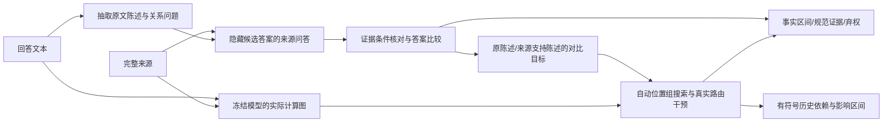

# 完整修订方案：约束条件下的消息采用与回看组定位

2026-09-13，结构修订3。初稿、三轮6.22/6.90/7.12分审查及历次完整方案保留。此文是待复审的方法，不是训练或检测结果。

## 问题锚点

对冻结LLM，在不以幻觉标签训练的条件下，测量来源和历史的信息实际传递、聚合与输出采纳；区分疑似错误被继续沿用、被反对/纠正以及新陈述开始。事实区间和影响范围分别评价，熵只提供候选起点。

## 对审查的取舍

接受：两个自由学习头+潜在证据集合+自由半马尔可夫分段没有足够监督，删除这些首版训练任务。所有LLM冻结，首版无新训练权重；有限干预是算法，不训练一个尚无可靠目标的替代网络。
接受：规范证据做支持性核查，生成图做采用、位置组和条件影响核查。主贡献是**识别有可核查内部路由证据的不支持陈述**，不宣称仅看 native 图就能识别事实真假。
修改：QA锚点比从零训练三类语义头更可审计。它仍可出错，因此保存问题、隐藏答案的来源回答、完整条件引文和弃权；它是模型估计，不能作为独立评价真值。
拒绝扩张：不加入AMR解析器、Graph Adapter、跨层SAE、额外GNN或训练式分段器。先完成一个可运行的图推断方法。若精确测量吞吐成为已测瓶颈，再只蒸馏联合干预效应作加速，不改变判定定义。

## 范围检查与主贡献

用户要解决的三个缺口不变：自动回看位置、信息路由后错误的延续、当前证据的条件归属。首版采用可错的冻结语义读者锚定“应当使用什么”，用生成器内部图测“实际使用什么”。**这不是已经证明仅靠生成器内部即可区分事实归属**。后者保留为未解决的科学问题，不能用QA性能替代。我们实现的是完整的、没有自然幻觉标签训练的离线审计方法；不把它命名为已成功的纯内部无监督检测器。

主贡献假设只有一个：条件化于可检查的证据锚点，自动搜索原生图中的消息组，其实际干预效应能够区分当前具体错误承诺、错误历史沿用与正确纠正。QA本身是复用模块和强基线，不声称新增事实核查架构。若图只能增加少量案例解释，这个假设失败；不能靠更名宣称收敛。

上述“纯内部独立判断事实”是尚需验证的更强研究问题；用户未禁止利用来源文本或冻结语义模型。方法使用语义锚点符合“不以幻觉标签训练”的既定问题锚点，但绝不据此宣称内部独立归属已经成功。新结构须实测内部图独立提出的采用候选，而不是让读者指定全部答案后再演示。

## 1. 核心结构与模型选择

固定使用已在本机的 Qwen3-8B 作语义读者，Llama3.1-8B作 native/observer 计算骨干。二者在单4090分阶段运行，不同时驻留。语义读者不用原生attention、logits或其熵判断正确证据。
语义读者将完整文本自动变成带原文区间的**陈述—约束图**；observer 构成带高维残差、V/O消息及attention关系的**计算图**。通过原文token/字符和证据区间映射建立图间对应。
首版图没有人工关系标签训练，也不以合成真假标签训练；冻结读者预训练本身含监督，不宣传为从原始文本完全无先验学习。

本方法默认完整回答后的自动审计，回溯定位先前节点；不冒称首错前在线预测。完整因果图仍只含每一步当时可见token。未来若做在线版，语义图也必须只看当前prefix，单独评价延迟。

## 2. 固定接口：什么是当前应该使用的证据

### 2.1 陈述与问题

读者仅看 task+response，不看来源：一次生成可重叠的 Claim 及关系问题。每个 Claim 保存 exact_quote、start/end、父句、原文回指区间、predicate、argument/qualifier 的原文区间。阶段、地点、条件、否定、数量/单位都保留为原文约束；未知字段置unknown，不自动补齐。
程序检查每个quote精确对应原文。找不到或多处同文无法唯一定位则弃权，不能挪动到已知错误位置。每个词被明确覆盖、非断言，或标 coverage_unknown；不能只报告抽取成功的好例子。
每个可核实关系生成 question、answer_quote（回答中声称的值/关系）、answer_span、premise_spans。问题中隐藏目标答案，但保留其它必要条件。对关系、动作和阶段也可提问，不限定名词或数字。
读者用**仅原回答**回答该问题并检查能否恢复 answer_quote：这是问题忠实性测试，不是来源真实性测试。失败为 invalid_question，不进入真假判定。

### 2.2 来源问答与证据集

来源读者输入完整D、task和问题；**不接收 answer_quote、完整response、先前真假判断或native选择**。
输出 source_answer、证据引文集合G、引用条件覆盖表及 answerability∈{answerable,not_stated,conflicting,uncertain}。所有引文必须是完整来源的精确子串，并映射到token；不是“模型说来源支持”就接受。
再独立提示核对引文能否覆盖问题全部前提与关系：同数字出现在别的阶段不通过；引文只能支持一部分前提则 partial，不强制答最相似的span。核对仍由冻结读者完成，不视为独立人工真值。
允许多个可替代证据集合：保留每组引用以及支持状态，不把未被引用的来源单位标成负例。不穷举全部幂集，不宣称最小证据集；若只发现一个集合，记 discovered_set，不记唯一。
多句联合证据作为一个集合交给来源问答/核对。不得以各单句得分max替代集合支持；没有发现集合不自动证明全文没有支持。

四种失败分开：not_stated=模型估计全文未说明；uncertain=读者不能确定；invalid_question=问法/前提不可靠；coverage_unknown=没有覆盖该词/断言。NULL仅是第一种的模型估计，后三种为abstain。所有这些状态都保存，不制造一个“确定无证据”的真值。

NULL分层：`reader_not_stated`仅是读者判断；`searched_family_none`指发现的候选集合中没有通过核对者；二者均不叫global absence。首版全文在上下文限额内才进入来源核查，超限明确coverage_partial并弃权；不截断。N升为可用估计需全文阅读、两种固定问法一致、逐来源单元条件核对没有留下未定的相关候选；仍是模型估计，并单列N准确率。字符串存在某数值不是存在适用答案，因而不接受“有同数值就禁止N”的建议。

### 2.3 不支持与最小归因范围

固定比较提示只看问题、回答所称answer、来源answer及经核对的条件证据，输出 E（等价且完整支持）、C（明确不兼容）、N（未说明）、U（不确定）。保存四个标签的条件logits及归一化分数，r=P(C)+P(N)。这个分数不是已校准真假概率。
问题有效且证据条件通过才允许E/C；N需要来源问答与条件核对均为not_stated。其余U。完全同字符串不跳过条件核对。
若所有前提被来源支持、只有目标答案不兼容，可定位answer_span。若问题有一个或多个未支持前提，只定位**整个相关Claim的可疑范围**，不得把若干NULL都归罪给目标槽。报告 `localization=slot|claim|unresolved`。
同一词由多个问题覆盖，保留各分数，不把多数E覆盖一个明确C；输出词级最大有效r，同时单列覆盖次数/U。没有有效核对的词输出score=0.5与abstain=true，参与全覆盖评价，不从分母排除。
分别保存r_contra=P(C)、r_missing=P(N)，合成r仅供不支持候选排序。固定初版审计阈值r≥0.8，支持条件P(E)≥0.8且核对有效；不满足两项之一或为U均记不确定。仅为预注册操作阈值，无80%准确率保证；自然测试只报告固定阈值结果和阈值无关曲线，不按结果调。

## 3. 生成图与当前事实的输出目标

### 3.1 图表示与预算

原生图以(position,layer)为计算节点，高维状态来自真实模型；消息与路由的权重保持head/GQA语义。图是计算组织结构，默认不存完整L×H×T×T数组，不将其训练成图网络。
每个新forward逐层处理：只提取本次gate要求的来源/历史位置和query块，保留原始H/V与O权重身份供复测，处理后释放大attention张量。其余全部上下文仍参与原模型运算；不提取某行不代表切断它。
句/Claim/问题答案的原文区间是上层分组，token节点与跨组连接仍存在。共享一个 source数字的不同事件不合并成一个证据节点。

### 3.2 两类语义对比，完整事件计分

A. `grounded_replacement`：当前问题为明确C，来源给出带完整条件的答案。只允许将answer_span替换为source_answer的精确引文；保留其它原字符，保存edit script。重新检查语法、全部前提和语义，不能通过则`contrast_requires_rewrite`。不让模型自由改写阶段或谓词后自证修好。
B. `withholding`：对于读者估计的N，不制造一个“正确数字”。为目标槽使用按语义类型固定的非承诺表达（duration: `an unspecified duration`; number: `an unspecified number`; entity: `an unspecified entity`; 未覆盖类型弃权）。保存完整替换脚本；若替换不合语法或改变目标槽外断言则无效。这只是**具体承诺相对不作具体承诺**的对比，不是来源支持答案，不叫事实修复。缺失判断仍依赖弱语义锚点。该类别单独评价，不能与A混报。

原事件B及替代事件A均保留同一原文终止边界，不超过96token；超限弃权。两者都在任何干预前确定，确定性tokenization后寻找完整公共前缀h；拒绝重复/互为前缀的事件。第一版只用一个A，避免不断添加说法改变分母。

F_G = log P_theta,G(B|D,h) − log P_theta,G(A|D,h).

`G`只改变公共前缀中的query节点，节点输入token完全相同；没有在分歧后的query上加新gate。两条分支都重新计算真实后缀网络，允许后缀attention/RMS/MLP不同。**不同后缀不使这个定义失效**：同一前缀干预改变了两个指定序列事件的概率比；它不说明后续每个生成节点都被解释，更不等于自由生成一定修复。拒绝把核心目标退化成首个数字/token，因为用户要研究多token约束与连续span。

每条记录保存`query_scope=shared_prefix_only`、两条完整input_ids、共同prefix长度、各branch gate位置（完全相同）及逐token logp。若采用不同分支长度，仍计完整序列概率，不做长度平均。实现初版已在`route_graph/causal_contrast.py`定义该量；该模块不是检测器。
F_first保存首分歧token的log-odds，仅诊断首步与后续偏好的差别。F_text原Claim平均词logp仅供无有效对比时的依赖诊断，二者都不代替主F、不用于证书特异性。

## 4. 路由与内容 gate 的精确定义

一个group G=(role,evidence_keys,query_set,layers)；role为source或history。默认layers=全部32层，层细分仅在已找到组后作诊断。所有后续网络均重新计算；固定离散历史的条件效应，不是干预后自由续写的总效应。

V gate：在指定query/head的O输入中，只将指定key的实际A_ij v_j乘λ，其它消息不动。它测内容消息贡献。
E gate：在指定query/head，把角色内指定证据key的attention乘λ，再在**该角色内部**重归一到接收状态原来的角色总质量，V不换、角色外连接不动。它测来源内部路由对应；若λ=0删掉该角色全部key或剩余质量为0，该干预invalid，不用epsilon制造有效分布。
λ∈{1,0.5,0}。sham λ=1必须完整logits逐值相同；所有gate前query必须不变。E和V分别出结果，不能把V有效称成E错。
第一版不声称Q或K、MLP单独负责错误。E没有选择性效应而V有，只是内容依赖；正确证据可见但输出错、又没有明确对比路由证书时记 `adoption_unresolved`，不凭排除法命名聚合错误。

## 5. 从内部图独立提出候选

来源首先按原文段落、句子和标点生成覆盖全部source token的层次区间树；回答历史同样处理。未解析的文本仍作为节点。**候选提议器不接收来源适用性分数、引文或reader选择**，仅接收source/history角色范围、原生计算以及冻结F。它对全部可见key域×回答query域建矩形组，从E/V/R/MLP实际效应提出候选，再询问语义读者这些候选与当前问题是否适用。读者之前给的规范证据仅作为另一条单列的参照流，不抢占native流的预算，也不冒充内部发现。

F仍由语义对比锚定，因此称`semantic-target-conditioned, evidence-candidate-blind`；不是对语义一无所知。以完整source/history根组的V及角色R开始；整role的E删除非法时不测，将key树分成非空子域后再测E。候选按|Δ|排序，同时保留推动B和反对B的组，以免丢掉正确证据的抵抗信号。子组弱时保留联合父组，允许两个已测不相邻query组的并；默认全部层，层带在后续复核。

内部candidate recall与reader是否认为它适用分开保存。没有内部候选就报告native_candidate_failure，不用reader候选替换后报成功。source key的语义落点只描述位置；其V已混入更早信息，不能直接命名“该引文的信息”。

### 5.1 同一oracle的四类操作

**E**：单角色内部路由，沿用§4。
**V**：选定实际消息内容缩放，沿用§4。
**R**：复用E重归一公式，但允许重分配域为source+history，保持两者合质量及其它角色不变；selected为整个source或history或已发现子集。domain没有其它非零可见质量则invalid。结果为cross_role_allocation_effect，不能定位Q/K的具体原因。
**M**：在所选query/layer将真实MLP输出乘λ，再完整运行其后的残差、归一化与attention。残差主支路不变。结果为MLP_branch_effect，不把整个MLP称作一个语义事实。

### 5.2 有量纲、有控制的组证书

所有操作采用同一个冻结F。Δ_del=F_base−F_G(0)，Δ_half=F_base−F_G(.5)；正值提高原事件B偏好，负值反对B。保存完整符号；不能将负值min-max成正权重。
候选组在观察控制效应之前确定两个对照：同gate/domain/query/layer，只有key集合不同；语义与目标/前提无关、原文不重叠、key数比和baseline mean attention mass比都在[.5,2]、可见query比例差≤.1；所有合格者按输入hash选前2。对照与候选均用同F，不用其它Claim的平均logp。找不到合格控制不发selective证书。

指定方向s=sign(Δ_del)，specificity=s*Δ_del−max_C|Δ_del(C)|。接受需|Δ_del|≥.5、specificity≥.25，half/full同号且|Δ_half|≤2|Δ_del|，独立重复差≤1e-5、sham完整logits逐值一致、gate之前query不变。阈值是操作定义，不是事实准确率或统计显著性。

通过者只叫position_anchored_route/content_effect；R叫cross_role_allocation_effect。正、负符号和C/N目标类别同时输出。U为同一候选key集合×完整query域×同layer域；只在删U\G后|F_base−F_keep|≤.25时标preserved_within_U，不称全模型充分子图。E/R keep若归一不合法就不返回此项。

默认32层联合证书是query_group_all_layers，不能假装单个计算节点。对一个最终组再测固定early/middle/late三带（32层为0–9、10–21、22–31），每带须完整复核。全层通过而三带不通过称distributed_all_layer_effect；层带也不等于具体layer。最小性只在已测试并完整验证过的家族内描述；不承诺唯一或100%定位。

## 6. 原始证据经哪条消息进入：嵌套介导

这是信息起源结论的必要检查，不能以“inner/outer各显著”代替真正嵌套测量。

对原始来源单元S（语义读者给它的条件关系，但native候选先独立产生），仅将其输入token embedding乘η∈{1,.5,0}；token ID、位置、RoPE、因果mask和其它embedding不变。在**完整相同公共前缀**执行donor forward，捕获已经选出的消息key K在指定各层的V_S^η。

另从原输入执行recipient：只在已选消息组G的A_ij V_j项将V_j替换成donor的V_S^η；其它边不直接替换，下游网络正常重算。recipient的实际当前A保留。这定义输入S经指定V消息组进入输出的干预通道；不是把donor的其它输入变化都偷偷带入recipient。该路径绕过S造成的QK变化，所以仅叫**V-message-mediated input effect**，不能叫全部信息起源或自然直接/间接效应。

M(S→G)=F_base−F_recipient(V_S^0 at G)。缓存donor值、recipient的具体边、原文S/token映射及哈希。η=1必须sham；η=.5/full同号；输入S的两个匹配无关控制也走同样donor→recipient流程。控制除长度/embedding范数外，还需匹配S对K的因果可达比例，不能用位于K之后、必然不可达的文本当零对照。

接受仍用|M|≥.5、同目标specificity≥.25、half/full与重放标准。仅这一嵌套效应通过才把位置消息升级为`input_origin_mediated_effect`。E位置路由有效、S→G介导也有效时，才能报告这个已测试通道中来源S的内容与路由共同参与当前偏好；不要求两者可加、不称全图唯一信息分解。

embedding零化是明确的非自然计算干预。它的结论受所选干预基线限制；重复/控制不能让它变成自然世界事实真值。其他prompt信息仍可通过同一个K流入，origin_nonexclusive=true。

## 7. 证据进入后，MLP是否抵消它

仅对经语义核对适用、且对应V消息或上节介导测量对B有负效应的E_app测此项；“attention看到了”不够。先以native流找到的query组/层带选定M，固定后作真实2×2：

F11=F(E_app on,M on)，F01=F(E_app off,M on)，F10=F(E_app on,M off)，F00=F(E_app off,M off)。

Δ_E=F11−F01；Δ_M=F11−F10；Ω=(F11−F10)−(F01−F00)。

要求Δ_E≤−.5，Δ_M≥.5，Ω≥.5。再用两个匹配无关V组C代替E_app，计算同样Ω_C，要求Ω−max|Ω_C|≥.25；MLP的半量交互同号且不超过2倍，重复/sham通过。控制是**同一MLP与不同消息的交互**，不是随便找一个时间更早、必然无效的MLP作对照。

结果称evidence_MLP_antagonism：适用消息反对B，MLP推动B，而且这种MLP效应依赖该消息存在。若只具备前两个方向而Ω不通过，报告opposing_paths，不冒充转换/覆盖关系。若E_app没有原始输入介导证书，只能称position_message_MLP_interaction。

该签名不保证“路由完全正确”，也不排除路由错误同时存在。不能把E失败、M成功用排除法当聚合错误。残差或QK覆盖仍可unresolved；首版测可辨的MLP交互，不推断未测细胞成因。

## 8. 预算与覆盖：按实际模型调用记账

增加的算子仍来自同一冻结模型，不新增训练头。每风险Claim硬上限256次模型forward，每回答上限1024次（最多4个按固定语义风险/原文顺序选择的Claim）；未纳入者保留语义结果和budget_unresolved。branch B/A各计一次，donor prefix也计一次，同时报告处理token数与时延，不用前缀forward冒充免费。

| 用途 | 最大forward数 | 固定规则 |
|---|---:|---|
| base及共同前缀sham | 4 | 两个分支各一次 |
| candidate-blind筛选 | 64 | 最多32个实际gate条件；E/V/R/M共用预算 |
| 位置/角色完整验证 | 30 | 最多3个组，各half、两control、keep、repeat；delete由筛选缓存 |
| 来源输入介导 | 36 | 最多2个(S,G)；每个full/half/sham/两control为15次，另3次重复 |
| E_app×MLP交互 | 24 | 复用base/单V/控制V；补noM/joint/两控制joint/half及repeat，缺基线也计入24 |
| 层带复核 | 36 | 一个最终组×3预定义带，每带delete+half+两control+keep+repeat=12 |
| N模板敏感性 | 16 | 2个预固定withholding模板；所选主证书在第二模板重测base/delete，交互则重测四状态 |
| 保留余量 | 46 | 仅明确缺失的验证基线、无效gate/格式失败仍计费；不用来改选成功组 |
| 合计 | 256 | 所有cache命中记0新forward且保留来源 |

R整个角色没有匹配同角色控制时，用**同R域、同query/layer、匹配质量的无关子集**只能给子集选择性，不能伪称整个role被matched；整个role先给allocation_effect，选择性需同一目标上有可达且可比控制，不满足则保持effect-only。必须输出该控制限制，不能临时把V controls嫁接给R。

停止规则：先完成筛选；按|Δ|和原文顺序冻结至多3组，然后只验证，不利用验证失败回补挑成功者。余量用于已选组的必要缺失前向，不拓展搜索。对N如果第二模板改变主效应方向，标template_sensitive，不能升为稳健具体承诺证书；C/N分别报告。

覆盖门槛在读自然标签前冻结：有效问题覆盖≥80%断言词、可构造对比≥70%风险Claim、至少一种完整内部选择性证书≥50%风险Claim；按任务、C/N与semantic/native/origin/interaction逐层给分母。低语义覆盖则不主张全回答核查；低对比覆盖不主张C/N总体路由识别；低native/origin覆盖不主张自动信息流与延续总体成功。不能把删光困难样本后的高准确率当收敛。

每回答1024调用是**机制教师的上限**，不是承诺这个成本适于17790全量主线检测。先测完整自然batch实际成本和覆盖；若计算瓶颈成立，唯一允许的后续学习模块是用实测Δ/Ω为目标的图读出蒸馏，需先证明教师准确/有覆盖。没有可靠教师前不训练一个看起来轻量但目标未成立的GNN。主线部署速度与教师诊断速度分开评价，当前不能提供已收敛全量指令。

## 9. 路由衍生、错误延续、纠正的可执行规则

`unsupported(c)`：有效语义核对r≥0.8，且不是U/invalid/coverage缺失。
`route_preference_witness(c)`：unsupported(c)且存在实测E位置选择性证书；只有同时通过原始输入介导、且原始输入单元被reader核对不适用或矛盾，才升级为constraint_route_witness。没有介导时不把key文本当信息来源。A类报告相对来源修订的错误偏好，B类报告相对非承诺表述的具体承诺偏好。不是`routing_error`原因真值，不叫自由生成修复。
若只有V selective_preference_witness，报告内容消息偏好效应；只有F_text只报告文本依赖；无可验证对比或预算不足保留unresolved。

Claim关系由语义读者输出same_claim/elaboration/correction/new_claim/unknown，并引用两侧原文。same/elaboration须相同predicate/目标slot或可检查回指；correction须明确替换/否定标记或同问题不兼容答案；仅主题相似一律unknown。new_claim要求不同目标命题，不因相同来源证据合并。检查基于原文结构而非事后幻觉标签；语义关系仍可能误判。
候选错误延续须同时满足：h与c均unsupported；关系same_claim或elaboration；h→c历史消息对当前坏/好陈述对比有正效应，且对h原始token的输入介导通过。只有历史落点效应时标position_history_dependency，不冒称该错误内容衍生。强历史依赖不足以继承标签。
纠正须当前c获来源支持且关系correction；它可以正向依赖此前错误文字，不强制历史Δ为负。若要称“抑制旧错误”，必须另定义旧命题复述vs当前正确命题的对比，不能混用两个F的符号。
新Claim即开新分组，source/history长边仍保留；主题相同也可有多个独立Claim，主题不同不自动抹去跨段依赖。

事实区间来自slot/Claim语义核对；图上自适应分组是陈述节点与经验证历史边的可重叠连通组，不是用同来源attention自动学习语义边界。条件影响区间来自后续各Claim的固定历史干预。两套边界、覆盖率和uncertain分开返回；不把RAGTruth标注边界当因果影响真值。

## 10. 推理顺序与产物

阶段A（Qwen、一次批处理）：自动Claim/问题、自洽、全文来源回答、条件核对、答案比较、可靠替代陈述。所有语义缓存落盘，并保存模型/提示/输入哈希和U原因。
阶段B（Llama、一次批处理）：自动共同prefix与图映射、baseline/sham、按固定预算搜索组、输出证书。不得把阶段A的结论当独立评价真值。
阶段C（CPU）：图上分组与两类区间输出。JSON每回答覆盖原文所有词（未覆盖词仍输出score=.5/abstain）；每Claim含source证据、Q/A、r、slot/claim范围、native/observer、contrast、组列表、E/V、Δ值、certificate/abstain/budget状态、历史关系。

主线模块放graph：evidence_anchor.py负责不泄漏的语义输入与图锚点；causal_contrast.py负责有限事件与E/V量；causal_groups.py负责预算搜索；grounded_audit.py负责覆盖、分组和输出。graph承载可复用原生oracle，reanchor仅调用作机制执行，避免主线依赖机制脚本。当前仅causal_contrast.py的计算内核实现，其余尚未实现；旧算子在ownership/adoption可复用，但不能把旧实现声称完整新方法。首版没有训练脚本。

## 11. 验证与资源门槛

不再运行O6单来源行为对照。下一次GPU任务必须运行上述完整输入→自动语义→自动位置组→span输出链条，先在按source hash冻结的自然RAGTruth开发来源完成所有样本；不能手工给错误位置或12/14候选。
开发来源来自官方train，先只读split/source_id元数据划分，含QA/Summary/Data2txt。调试指标与既看过QA test均探索性；确认性评估在结构/阈值冻结后另用新来源/外部数据。自然标签仅独立评价，不供语义读者/搜索/配置选择。
主比较：同一个语义锚点（无计算图）vs完整路由审计，分别评价不支持检测、路由解释覆盖/特异性、错误延续与纠正误报；若图仅增加解释，不声称提升事实检测AUROC。另以固定entropy/RAUQ作廉价基线。
资源：Qwen只生成有长度界限的JSON/问答；语义调用数随自动Claim数计入，超限弃权而不丢样本。Llama机制教师每风险Claim≤256、每回答≤1024实际前向，比现有8条件全量更贵；先测完整自然batch的真实延迟/显存，再决定全量预算。没有凭空给6–16小时承诺。
在看自然标签前冻结适用性门槛：有效语义问题覆盖≥80%断言词、可构造A/B对比≥70%风险Claim、完整E或V selective witness≥50%风险Claim，并按三任务与C/N分别报分母；这些是部署覆盖门槛，不是精确度目标。若低于门槛，不能宣称完整自然方法有效，应从实际首要失败环节修订，不能仅增加示范案例。
原全量17790任务继续且冻结；新审计调度需要独占并自动恢复，不混同目录。工程检查和方法审查不能替代真实自然数据有效性。

## 当前仍需复审的实质问题

首版是可检验的机制教师结构：语义锚点、native独立候选、带原始来源介导的消息图、角色分配与MLP交互、图上延续关系。不是纯内部事实读出成功，也不是已适于全量快速推理的学生模型。必须在自然完整链条上验证来源问答的可靠性、选择性/介导覆盖、连续错误vs纠正，以及成本；没有这些不能宣称方法实证收敛。

是否需要GNN由实测教师信号决定：若介导/路由根本不区分，蒸馏不会创造缺失信息；若可区分但每条都精确干预昂贵，再蒸馏一个明确目标的图读出。当前先补齐决定性测量，避免再做已知关系会影响输出的简单案例。
